# Decode backend foundation plan

**Status:** Pending approval — architecture and implementation plan only  
**Date:** 2026-08-04 (revised for V1 shipping scope)  
**Scope:** North-star domain architecture plus the smallest Railway-deployed walking skeleton that proves it  
**Explicitly excluded:** Backend implementation, database migrations, external-provider integration, and HyperFrames integration

## 1. Executive decision

Build Decode as a **modular monolith with asynchronous workers**.

- FastAPI is the application/API boundary.
- Standard PostgreSQL is the system of record. V1 deploys it on Railway; SQLAlchemy and Alembic preserve portability to Supabase, Neon, or another PostgreSQL host.
- V1 does not couple identity or authorization to a database vendor. Authentication is deliberately postponed until the first skeleton proves the production workflow, unless the existing frontend requires a minimal session adapter sooner.
- Cloudflare R2 stores source documents, generated audio, images, composition bundles, previews, scene renders, and final exports.
- Redis and ARQ deliver work; they are not the source of workflow truth.
- A transactional PostgreSQL outbox bridges committed domain changes to ARQ safely.
- Departments are application-level execution policies behind one contract, not network services.
- The five visible crew roles remain the product vocabulary. Internal agents and tools remain implementation details.
- HyperFrames remains behind a renderer port and is not part of the core domain.

The first backend should prove one complete, resumable artifact chain. It should not begin by building a generic workflow engine or by integrating every AI provider.

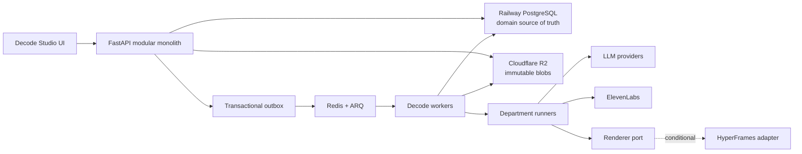

### Managed database decision: Railway PostgreSQL for V1

Use **Railway PostgreSQL** for the private-beta walking skeleton. This is an operational choice, not a domain dependency.

| Decision factor | Railway PostgreSQL | Supabase | Neon | Decode interpretation |
|---|---|---|---|---|
| V1 operations | Same platform as API, worker, and Redis | Additional platform | Additional platform | Railway minimizes setup and operational surface. |
| PostgreSQL compatibility | Standard PostgreSQL | Standard PostgreSQL plus optional platform APIs | Standard PostgreSQL plus optional platform APIs | SQLAlchemy/Alembic keeps all three viable. |
| Auth/collaboration | Decode supplies these later | Mature bundled Auth/Realtime | Built-in Auth and branching | These do not justify adopting a larger platform before the core pipeline works. |
| Cost shape | Small usage-based services | Predictable base plan | Usage-based, scale-to-zero | The difference is secondary to reducing V1 complexity. |

**Provider-neutral boundary rules:**

1. FastAPI owns every Decode domain command and query.
2. API and workers access PostgreSQL only through SQLAlchemy; schema evolution uses Alembic.
3. Core behavior must not depend on vendor Data APIs, database webhooks, hosted functions, proprietary auth tables, or realtime products.
4. PostgreSQL features with broad managed-provider support are allowed. Provider-specific features require a later ADR.
5. Cloudflare R2 remains the object store; Redis/ARQ remains the delivery mechanism.
6. Durable progress is delivered through curated FastAPI SSE events, never raw table subscriptions.
7. A future move to Supabase or Neon is an infrastructure migration, not a domain rewrite.

Supabase should be reconsidered when Auth, RLS-assisted collaboration, Presence, or operational tooling provides measurable value. Neon should be reconsidered when database branching, preview environments, or scale-to-zero economics becomes a dominant need.

## 2. Product contract derived from the UI

The existing frontend is not throwaway inspiration; it is the current product contract.

- It deliberately exposes five stages—Understanding, Teaching Plan, Script, Edit, and Export—in the project shell ([ProjectShell.tsx](/Users/moinuddinshaik/Downloads/decode/apps/frontend/src/components/project/ProjectShell.tsx:32)).
- It deliberately exposes five crew roles and explains why internal agent count must not leak into product vocabulary ([crew.ts](/Users/moinuddinshaik/Downloads/decode/apps/frontend/src/lib/crew.ts:3)).
- Voice is explicitly a Writer-owned output rather than a department, and audio is intended to make duration measured rather than invented ([crew.ts](/Users/moinuddinshaik/Downloads/decode/apps/frontend/src/lib/crew.ts:23)).
- Scene identity is expected to survive reorder, split, merge, and duplicate ([types.ts](/Users/moinuddinshaik/Downloads/decode/apps/frontend/src/lib/types.ts:66)).
- The prototype already distinguishes scene-scoped downstream drift for visuals, assets, and voice ([studio.ts](/Users/moinuddinshaik/Downloads/decode/apps/frontend/src/store/studio.ts:44)).
- Narration edits and visual-prompt edits invalidate different downstream subsets ([studio.ts](/Users/moinuddinshaik/Downloads/decode/apps/frontend/src/store/studio.ts:243)).
- Reordering a teaching plan invalidates plan and script approval in the prototype ([studio.ts](/Users/moinuddinshaik/Downloads/decode/apps/frontend/src/store/studio.ts:322)).
- Stage navigation is gated by prior approvals ([derive.ts](/Users/moinuddinshaik/Downloads/decode/apps/frontend/src/lib/derive.ts:127)).
- Export is disabled while any scene has unresolved downstream drift ([Export.tsx](/Users/moinuddinshaik/Downloads/decode/apps/frontend/src/components/project/stages/Export.tsx:64)).
- The frontend already has a deliberate API seam: seeded functions are intended to become FastAPI calls and generation streams ([api.ts](/Users/moinuddinshaik/Downloads/decode/apps/frontend/src/lib/api.ts:1)).

### Agreed refinements

1. Actual ElevenLabs audio duration is the final timing authority.
2. Teaching-plan duration is a target budget, not a fabricated media duration.
3. Editing an approved artifact creates a new unapproved version; the previous approved version remains intact.
4. A discussion follows the stable artifact identity; every message records the artifact version in view when it was sent.
5. The UI permanently exposes the five crew roles. Renderer, evaluator, publisher, tools, and sub-agents remain internal.
6. “Re-record” becomes “Regenerate voice.”
7. “Professional / Friendly / Storyteller” becomes Narration Style or Delivery, separate from the ElevenLabs voice profile.

## 3. Architecture principles

1. **Artifacts are the protocol.** Departments never call each other.
2. **Content is immutable; selection is mutable.** Artifact versions never change, while project projections select which versions are current or approved.
3. **No hidden compute after edits.** A save may mark downstream artifacts stale, but a user command starts regeneration.
4. **Scope is explicit.** Every artifact, dependency, job, run, discussion, and evaluation has project scope and optional scene scope.
5. **PostgreSQL owns truth.** The V1 host is Railway. Redis accelerates execution and delivery but cannot determine whether work exists or completed.
6. **The renderer is a port.** Video is the first output capability, not the product domain.
7. **Reasons are evidence summaries.** Store concise rationales, inputs, evaluator results, and receipts—never private model chain-of-thought.
8. **Start explicit.** Encode Decode's known workflow in application code before considering a user-configurable workflow engine.

## 4. Non-goals for the first backend

- Microservices per department.
- Kafka or another event-streaming platform.
- A generic DAG/workflow-definition product.
- CRDT collaborative text editing.
- Multiple renderer implementations in production.
- Distributed video rendering.
- Scene-segment export caching.
- Multi-provider model routing.
- Automated background regeneration after user edits.
- A universal schema capable of representing every future output on day one.
- Artifact discussions and conversational mutation.
- Automated evaluation revision loops, escalation policies, and a generic checkpoint engine.
- Credits, invoices, entitlements, and a billing engine; V1 records provider usage only.
- Real AI, TTS, renderer, scene, timeline, or export integrations in the first walking skeleton.
- Multiple specialized worker pools; V1 has one general worker process.

The architecture must leave seams for those capabilities without paying their operational cost now.

### Walking-skeleton scope gate

| Responsibility | Build now | Preserve contract | Postpone |
|---|---:|---:|---:|
| Projects, repeatable single-source upload, Production Intent | Yes | Yes | Batch-upload subsystem |
| Artifact/ArtifactVersion, lineage, current/approved projections | Yes | Yes | — |
| Dependency graph | Exact edges for the brief | Yes | Scene closure/materialized staleness |
| Job/Run, transactional outbox, Redis/ARQ | Minimum durable path | Yes | Cancellation, advanced leases, reconciliation automation |
| Context isolation and department contract | Fake Producer only | Yes | Director/Writer/Motion Designer/etc. |
| Evaluation | One recorded evaluation | Yes | Revision loop, escalation, policy engine |
| Human review | Edit and simple immutable approval | Yes | Generic checkpoints and complex gates |
| Metering | Raw usage and estimated cost | Yes | Credits, balances, quotas, billing |
| Progress | Durable SSE | Yes | WebSockets/presence |
| Discussions | No | Stable artifact/version addressing | Yes |
| Scenes and incremental regeneration | No | Exact version graph and scene-capable scope | Yes |
| TTS, media, timeline, export | No | Artifact and provider seams | Yes |
| Renderer/HyperFrames | No adapter | Renderer port remains stable | Yes |
| Collaboration/Auth | Trusted private-beta boundary only | Actor fields remain extensible | Product auth and multi-user policy |

## 5. System context

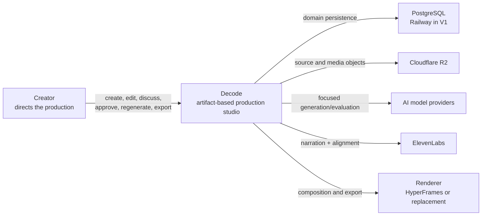

## 6. Backend module boundaries

Use one deployable codebase. The north-star boundaries below remain valid, but V1 implements only four coarse modules and introduces a new module only when real behavior requires it.

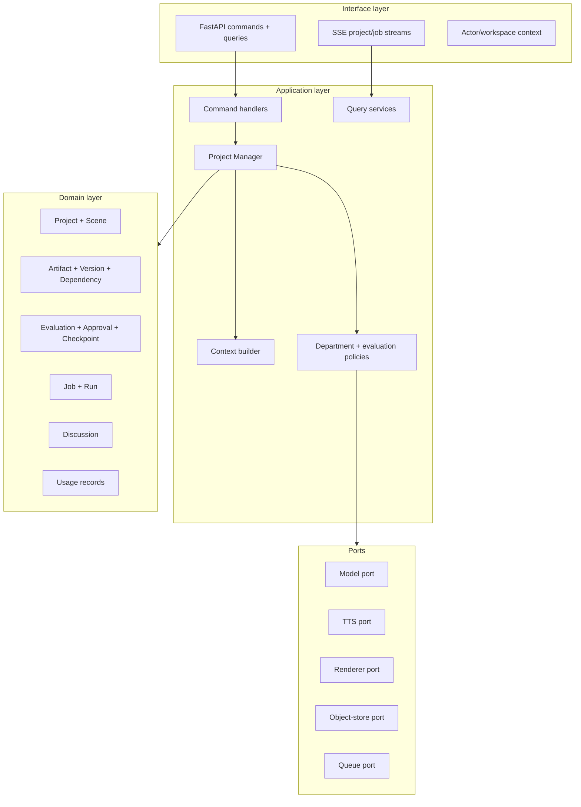

### Walking-skeleton module profile

| Module | V1 ownership | Likely later extractions |
|---|---|---|
| `projects` | Project lifecycle, source metadata, production intent | Stable scenes and workspace policy stay here initially. |
| `artifacts` | Artifact identities, immutable versions, dependency edges, latest/approved projections, simple evaluation and approval records | Evaluation and discussion split only after they have distinct policies. |
| `execution` | Jobs, runs, outbox, ARQ dispatch/consumption, fake Producer, context manifest, SSE progress, usage facts | Production orchestration and metering split only when multiple departments make the boundary useful. |
| `providers` | PostgreSQL/R2/Redis adapters plus model, TTS, and renderer ports; V1 implements R2/Redis and a fake Producer path | Media or individual provider packages split when their SDK/runtime needs demand it. |

FastAPI routes may be grouped by these modules without introducing a separate `api` domain. Shared utilities are allowed only for genuinely cross-cutting technical concerns such as settings, database sessions, logging, and identifiers.

The north-star modules—`production`, `evaluation`, `discussion`, `media`, and `metering`—are extraction destinations, not V1 folders to create empty.

## 7. Core domain model

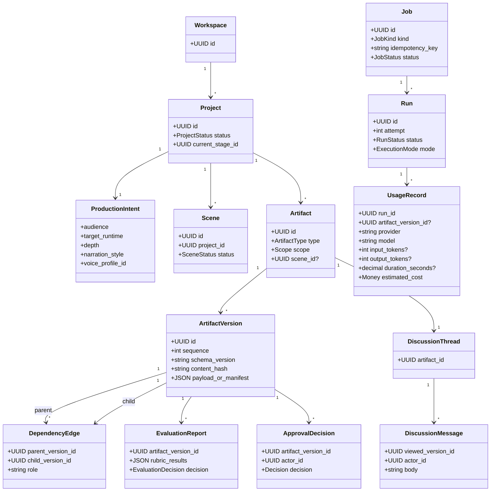

This diagram is the north-star model. The V1 walking skeleton persists only `Project`, `Source`, `Artifact`, `ArtifactVersion`, `DependencyEdge`, `ApprovalDecision`, `EvaluationReport`, `Job`, `Run`, `UsageRecord`, and `OutboxEvent`. Production Intent is a typed artifact/version in V1, not a second mutable content table. `Workspace`, `Scene`, `Discussion`, `ReviewReport`, `Checkpoint`, and a credit ledger are deferred.

### Essential distinctions

#### Artifact versus ArtifactVersion

`Artifact` is the stable thing the user recognizes: “Scene 5 Script.” `ArtifactVersion` is an immutable state of that thing. Editing creates a version; it never overwrites one.

Maintain two mutable projections per artifact:

- `latest_version_id`: most recently created candidate.
- `approved_version_id`: version approved for authoritative downstream use.

These are pointers, not content mutation.

#### Scene versus artifact

`Scene` is a stable project entity used for identity, selection, ordering, comments, and scope. Its script, narration, visual specification, render, and evaluation are separate artifacts.

Split creates two new scene identities and retires the source scene. Merge creates a new scene identity and retires both parents. This preserves lineage; it is safer than pretending a merged scene is still the first input scene.

#### Job versus Run

- `Job` records the user's requested outcome.
- `Run` records an attempt to achieve it.
- Retries create new runs under the same job.
- A second user request creates a new job, even when inputs happen to be identical.
- Idempotency prevents duplicate HTTP/queue delivery from producing duplicate runs or artifacts.

#### Evaluation versus review versus approval

- `EvaluationReport` is structured evidence produced by an evaluator.
- `ReviewReport` is an artifact that may synthesize several evaluations.
- `ApprovalDecision` is a human or policy decision about one immutable version.
- `Checkpoint` defines required conditions for a stage transition.

Do not store one “quality score” as the truth. Store rubric results and derive a UI summary score.

## 8. Artifact envelope

Every artifact version uses a common envelope with a type-specific payload.

| Field | Meaning |
|---|---|
| `id` | Artifact-version UUID |
| `artifact_id` | Stable artifact UUID |
| `project_id` | Required project scope |
| `scene_id` | Nullable scene scope |
| `artifact_type` | Registered type such as `teaching_plan` or `narration` |
| `schema_version` | Payload schema version independent of app release |
| `sequence` | Monotonic within stable artifact |
| `content_hash` | Canonical JSON or blob-manifest hash |
| `payload` | Structured JSON when appropriately small |
| `blob_manifest` | R2 object references with hashes/MIME/size |
| `parent_version_ids` | Exact input lineage, represented relationally |
| `owner_role` | Product crew role responsible for the handoff |
| `created_by` | User, system policy, or run identity |
| `created_at` | Server timestamp |
| `rationale` | Concise decision summary, not chain-of-thought |
| `run_id` | Execution attempt that produced it, when generated |
| `supersedes_version_id` | Previous version when applicable |

Artifact payload schemas live in a registry in application code. Unknown artifact types must not be accepted merely because the envelope is generic.

## 9. Video artifact dependency graph

The UI remains five stages, while the internal artifact graph can be more precise.

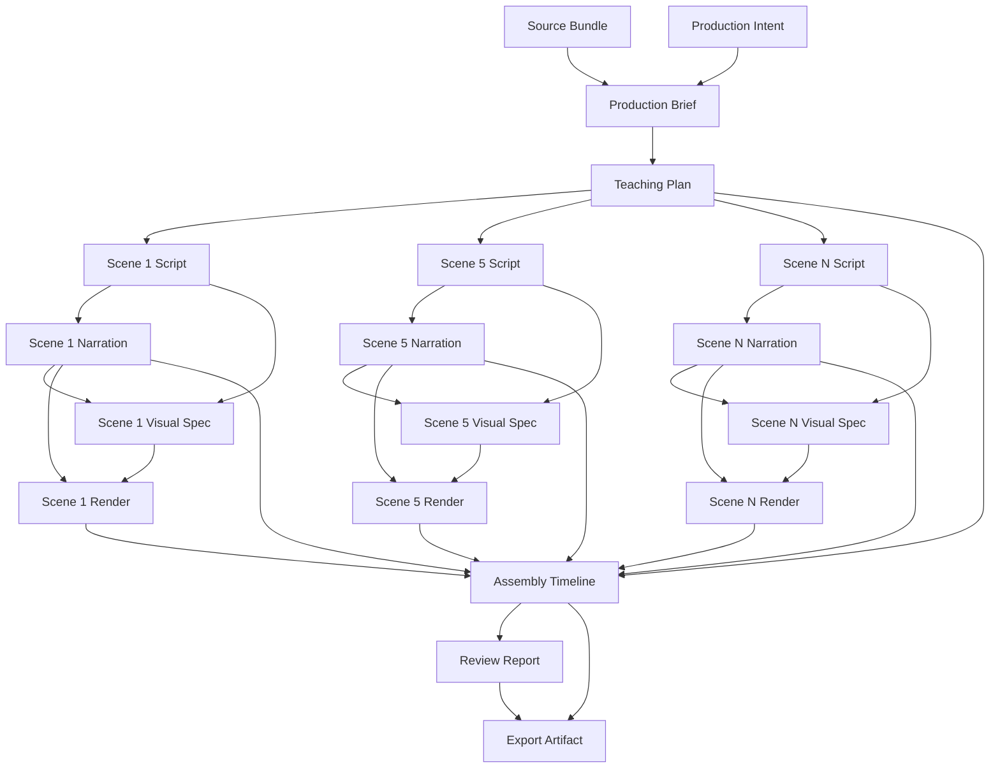

### Dependency rules

- All dependency edges bind exact artifact-version IDs, never “latest.”
- A downstream version is stale when a project-selected input differs from the version in its dependency edge.
- Staleness is a derived fact. It may be materialized for fast UI queries, but the edges remain authoritative.
- Scene-scoped inputs invalidate only the same scene plus global artifacts that consume it.
- The Assembly Timeline is global and can become stale while still reusing unchanged scene renders.
- An Export is immutable and never becomes retroactively stale. Instead, the project indicates that a newer current cut exists.

## 10. TTS and timing model

The current prototype stores one scene duration and evenly distributes tokens across it ([derive.ts](/Users/moinuddinshaik/Downloads/decode/apps/frontend/src/lib/derive.ts:4)). Production replaces that approximation with three explicit timing values.

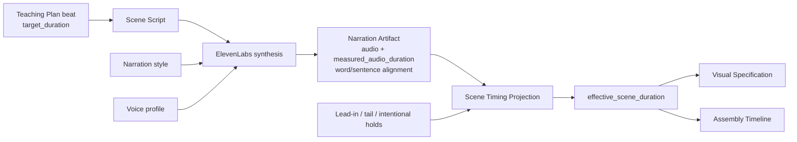

Definitions:

- `target_duration`: Director's creative budget.
- `measured_audio_duration`: exact generated-audio duration.
- `effective_scene_duration`: measured audio plus explicit lead-in, tail, or hold segments.

Rules:

1. TTS must never silently time-stretch audio to hit the target.
2. If measured duration exceeds the target tolerance, revise the Script once and synthesize a new Narration version before escalating to the creator.
3. Word timing comes from ElevenLabs alignment when available; forced alignment is a replaceable fallback.
4. Captions and visual cue points use measured alignment, not equal word spacing.
5. Changing narration style or voice profile creates a new Narration version and may invalidate Visual Specification, Scene Render, Timeline, Review, and future exports for that scene.

Initial tolerance decision: measured duration may differ from the target by the greater of 1.5 seconds or 5%. Outside that range, attempt one Script revision and TTS pass. If the second result still misses, preserve it, show the measured delta, and ask the creator rather than silently stretching audio.

## 11. Artifact-version lifecycle

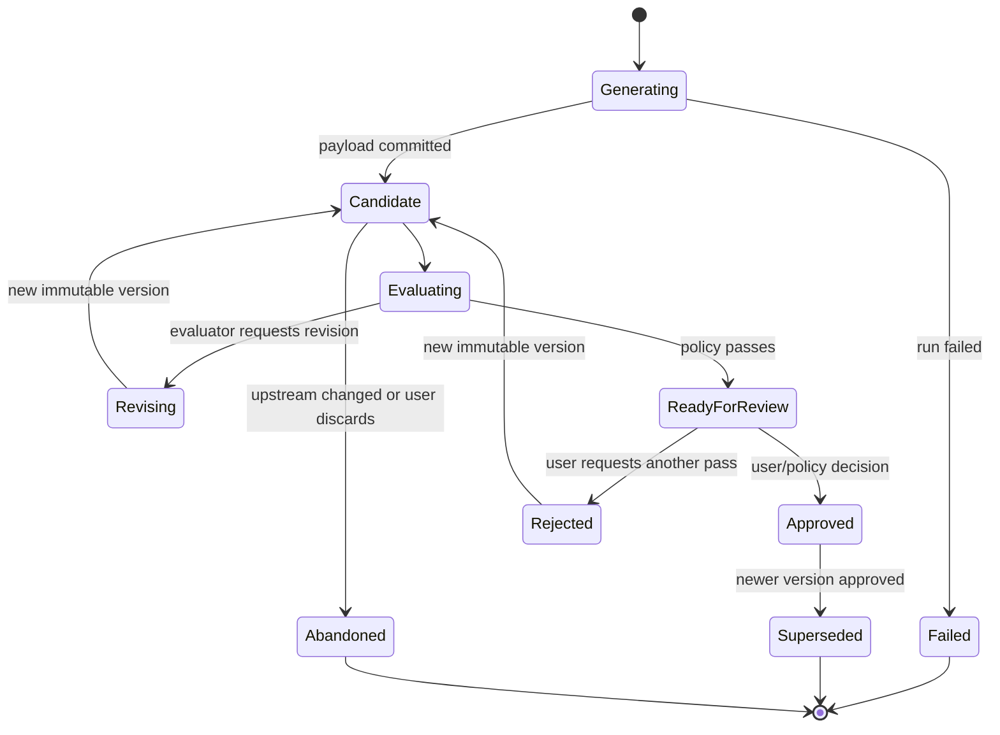

Lifecycle status must not be confused with staleness:

- An approved version can be stale relative to a newer upstream selection.
- A candidate can be current for editing but not approved for downstream publication.
- A superseded version remains retrievable and auditable.

## 12. Job and run lifecycle

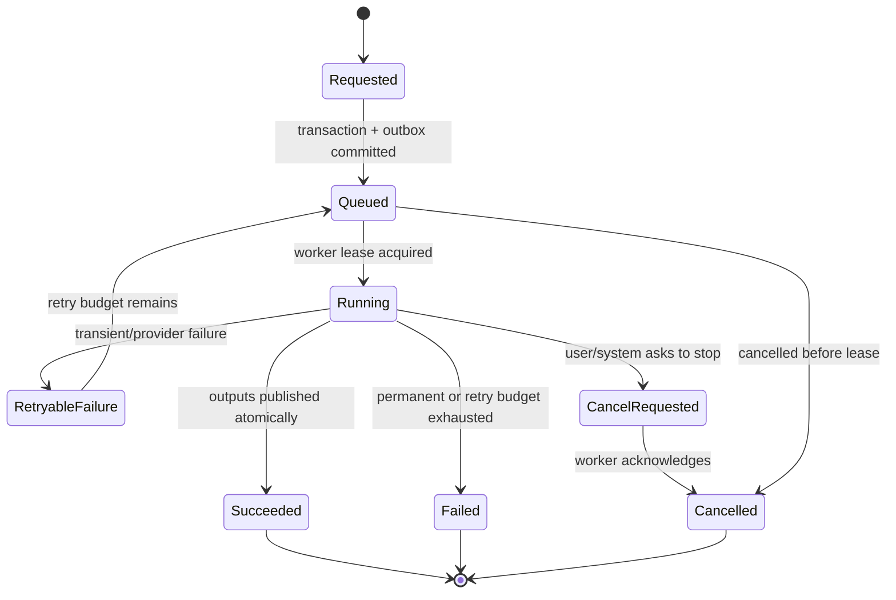

Required execution properties:

- Lease timeout and heartbeats for long work.
- At-least-once queue delivery with idempotent handlers.
- Unique output publication key based on job, run, artifact type, and input hashes.
- Attempt history retained after retry.
- Cancellation propagated to provider and renderer when supported.
- Reconciler finds queued/running database jobs that Redis lost or workers abandoned.

These are north-star execution properties. V1 implements durable status, at-least-once idempotency, visible attempts, safe manual retry, and a simple job timeout. Heartbeats, cancellation propagation, automated lease recovery, and a general reconciler are added when real provider calls create long-running failure modes.

## 13. Initial-project sequence

The first implementation stops at an approved Production Brief. It deliberately uses a deterministic fake Producer so architecture failures are not confused with model variability.

```mermaid
sequenceDiagram
    actor U as User
    participant UI as Decode UI
    participant API as FastAPI
    participant DB as PostgreSQL
    participant O as Outbox
    participant Q as ARQ
    participant W as Railway ARQ worker
    participant FP as Fake Producer
    participant R2 as R2

    U->>UI: Create project
    UI->>API: CreateProject(command, idempotency_key)
    API->>DB: Persist project
    U->>UI: Upload source and enter production intent
    UI->>API: AttachSource + SaveProductionIntent
    API->>R2: Store source blob by content hash
    API->>DB: Persist source metadata and intent
    UI->>API: GenerateProductionBrief
    API->>DB: Commit job, run, and outbox event
    API-->>UI: project_id + job_id
    O->>Q: Dispatch job
    Q->>W: Execute job at least once
    W->>W: Build focused context manifest
    W->>FP: Generate deterministic brief
    FP-->>W: Brief payload + fake usage
    W->>W: Evaluate with deterministic V1 rule
    W->>DB: Atomically publish ArtifactVersion, lineage, evaluation, usage, progress
    W-->>UI: SSE Production Brief ready for human review
    U->>UI: Edit brief
    UI->>API: SaveArtifactEdit(base_version_id)
    API->>DB: Create new immutable version; preserve prior version
    U->>UI: Approve selected version
    UI->>API: ApproveArtifactVersion(version_id)
    API->>DB: Record immutable decision; update approved projection
    UI->>API: Get artifact history
    API-->>UI: Versions, current/approved markers, lineage
```

This slice proves the domain, transaction, queue, storage, versioning, approval, history, and progress seams. It does not generate a Teaching Plan, scenes, narration, visuals, or video.

## 14. Approval and stage transition sequence

The immutable approval record and approved projection are V1. Automatic checkpoint evaluation and downstream job creation in this sequence are post-V1.

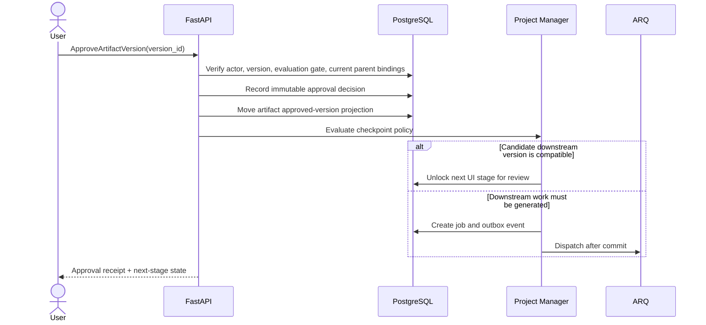

Approving the initial Script explicitly authorizes Narration generation and the next visual stage. Editing later does not automatically authorize regeneration.

## 15. Human edit and incremental regeneration sequence

```mermaid
sequenceDiagram
    actor U as User
    participant API as FastAPI
    participant ART as Artifact Service
    participant GRAPH as Dependency Graph
    participant PM as Project Manager
    participant W as Worker

    U->>API: Save Scene 5 Script edit based on v7
    API->>ART: Create immutable v8
    ART->>ART: Keep v7 approved; set v8 latest/unapproved
    ART->>GRAPH: Recompute affected projection
    GRAPH-->>API: Narration, Visual Spec, Render, Timeline and review are stale
    API-->>U: v8 saved + exact stale set
    Note over API,W: No compute starts

    U->>API: Update downstream for Scene 5
    API->>PM: Create regeneration job with v8 and selected scope
    PM->>W: Generate/evaluate Narration vN
    W->>W: Generate Visual Spec and Scene Render
    W-->>ART: Publish new Scene 5 versions
    ART->>GRAPH: Recompute timeline/review/export projections
    API-->>U: Stream receipts and new artifact versions
```

### Regeneration scope choices

The command must carry an explicit scope rather than inferring permission:

- `voice_only`
- `visuals_only`
- `scene_all`
- `downstream_from_version`
- `project_stale_set`

The server validates that the requested scope is compatible with the actual dependency graph.

## 16. Discussion model

**Deferred from V1.** The following remains the intended contract, but no discussion tables, routes, prompts, or UI integration are built until the first production pipeline works end to end.

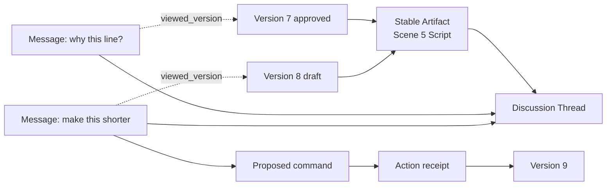

Rules:

- There is no global chatbot memory used for production decisions.
- UI context determines the addressed artifact and currently viewed version.
- A message may be informational or propose a typed command.
- Mutating commands require normal authorization and optimistic concurrency; the conversational surface does not bypass domain rules.
- Every completed action produces a receipt linking the message, command, job/run, and resulting artifact version.

## 17. Event flow and consistency

Use domain events for audit and projections, not as a substitute for explicit application commands.

Core events:

- `ProjectCreated`
- `SourceAttached`
- `ProductionIntentChanged`
- `JobRequested`
- `RunStarted`
- `RunProgressRecorded`
- `ArtifactVersionCreated`
- `EvaluationCompleted`
- `ArtifactVersionReadyForReview`
- `ArtifactVersionApproved`
- `ArtifactCurrentVersionChanged`
- `DownstreamBecameStale`
- `RegenerationRequested`
- `RunSucceeded`
- `RunFailed`
- `ComputeUsageRecorded`
- `CheckpointSatisfied`
- `ExportCompleted`

V1 emits only `ProjectCreated`, `SourceAttached`, `ProductionIntentChanged`, `JobRequested`, `RunStarted`, `RunProgressRecorded`, `ArtifactVersionCreated`, `EvaluationCompleted`, `ArtifactVersionReadyForReview`, `ArtifactVersionApproved`, `ArtifactCurrentVersionChanged`, `RunSucceeded`, `RunFailed`, and `ComputeUsageRecorded`. Add the remaining events with their owning behavior.

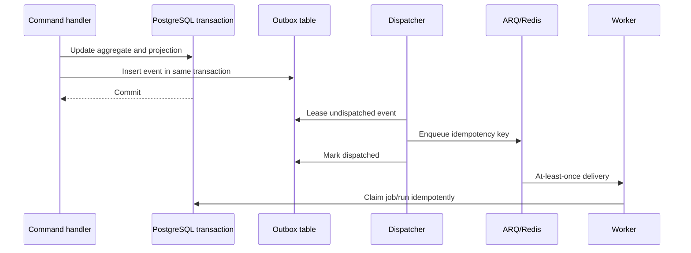

Do not enqueue work before the database transaction commits. Do not infer job success from a missing Redis entry.

## 18. Context isolation contract

Every department run receives a `ContextManifest`, built and hashed before execution.

It contains:

- Exact input artifact-version IDs.
- Selected excerpts or structured fields required by the department.
- Scene ID when scene-scoped.
- Tool/skill/model policy version.
- Output schema version.
- Evaluation rubric version.
- Execution mode and budget.

It must not contain:

- Full chat history.
- Unrelated scenes.
- The complete source document unless the department contract explicitly requires it.
- Another department's private working context.
- Credentials or provider secrets.

Store the context manifest or its reproducible materialization recipe with the run so failures can be debugged without reconstructing hidden state.

## 19. Evaluation loop

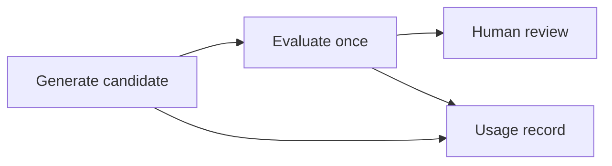

V1 runs one evaluator and records its structured result. It does not automatically revise, approve, retry for creative reasons, enforce a quality gate, run checkpoint policy, or escalate. Human review decides whether to edit, regenerate, or approve. Infrastructure retries remain an execution concern and must not create duplicate artifact versions.

The persisted shape should allow later evaluator policy to add rubric versions, revision budgets, escalation, and checkpoint rules without changing ArtifactVersion identity or lineage.

## 20. Persistence responsibilities

### PostgreSQL

Store:

- Workspaces, actors, projects, production intent, stable scenes.
- Artifact identities, versions, dependency edges, projections.
- V1 evaluation results and immutable approvals. Checkpoint policy is deferred.
- Jobs, runs, leases, progress summaries, cancellation.
- Usage facts: provider, model, input/output tokens, duration, estimated cost, and associated run/artifact when applicable.
- Outbox and idempotency records.

Discussion records, credit conversion, billing balances, and advanced checkpoint state are not V1 persistence requirements.

Use JSONB for typed artifact payloads initially, with Pydantic validation and explicit schema versions. Promote high-query fields to columns only when query evidence justifies it.

### Cloudflare R2

Store immutable content-addressed objects:

- Uploaded source files.
- Extracted page images and source derivatives.
- TTS audio and alignment payloads.
- Generated visual assets.
- Composition bundles and preview snapshots.
- Scene renders and final exports.

Database records store object key, content hash, size, MIME type, original filename where applicable, encryption/retention metadata, and provenance.

### Redis and ARQ

Use for:

- Queue delivery.
- Short-lived worker coordination.
- Rate limiting and provider concurrency.
- Ephemeral progress fan-out.

Do not use for:

- Canonical job state.
- Artifact dependency truth.
- Approval state.
- Usage-record truth.
- The only copy of progress needed for recovery.

## 21. Deployment shape

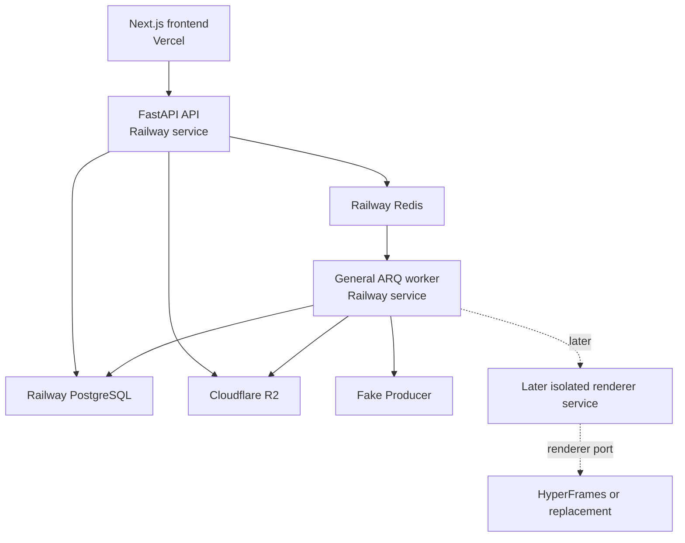

The API and worker use the same image/codebase with different process commands. Railway supplies V1 PostgreSQL and Redis. R2 remains external because artifacts and media must outlive disposable service filesystems.

There are only two application services in V1: API and worker. A renderer service is introduced only when rendering begins, because it requires a different runtime and security boundary. HyperFrames is absent from the walking-skeleton dependency graph.

## 22. Proposed backend project structure

```text
apps/backend/
├── pyproject.toml
├── app/
│   ├── main.py
│   ├── settings.py
│   ├── database.py
│   ├── projects/
│   │   ├── models.py
│   │   ├── schemas.py
│   │   ├── service.py
│   │   └── routes.py
│   ├── artifacts/
│   │   ├── models.py
│   │   ├── schemas.py
│   │   ├── service.py
│   │   └── routes.py
│   ├── execution/
│   │   ├── models.py
│   │   ├── service.py
│   │   ├── outbox.py
│   │   ├── worker.py
│   │   └── events.py
│   └── providers/
│       ├── objects.py
│       ├── queue.py
│       ├── producer.py
│       └── renderer.py
├── migrations/
└── tests/
    ├── unit/
    ├── integration/
    └── e2e/
```

Files are created when their first behavior is implemented. `producer.py` contains the department contract and deterministic fake implementation for V1. `renderer.py` contains only the stable port contract if needed to lock the architectural seam; it has no HyperFrames dependency or adapter yet.

## 23. API interaction style

Use task-oriented command endpoints and resource-oriented queries.

V1 commands:

- Create project.
- Attach source.
- Save production intent.
- Request Production Brief generation.
- Save artifact edit against a base version.
- Approve artifact version.

V1 queries:

- Project studio snapshot.
- Artifact history and lineage.
- Job/run detail.
- Usage facts by job/run.

Regeneration scopes, cancellation, discussions, scene status, timeline, and export commands are added with the stages that need them.

Commands return durable identifiers and current projections. Long operations stream progress through SSE keyed by project/job, with reconnect support using event sequence IDs. WebSockets are unnecessary for the first version.

Use optimistic concurrency for edits:

- Client supplies `base_version_id`.
- Server rejects or explicitly rebases when the current latest version differs.
- The API never silently overwrites another edit.

## 24. Build sequence

### V1-0 — Freeze the walking-skeleton contract

Detailed command, query, payload, SSE, route, and UI mapping: [Decode V1 UI-to-backend contract](/Users/moinuddinshaik/Downloads/decode/.omc/plans/decode-v1-ui-backend-contract.md:1).

Deliverables:

- Approve this plan and ADRs.
- Register only `source`, `production_intent`, and `production_brief` artifact payload schemas.
- Define the V1 commands, query responses, department contract, context manifest, and event vocabulary.
- Map only the frontend screens/actions needed for this slice.
- Define provider-neutral environment variables for PostgreSQL, Redis, and R2.

Exit criteria:

- Every walking-skeleton UI action maps to one command or query.
- Artifact, version, dependency, approval, job/run, usage, and outbox invariants have executable test cases.
- No contract mentions Supabase, Neon, HyperFrames, ElevenLabs, or a real model provider.

### V1-1 — Persistence and synchronous domain path

Deliverables:

- FastAPI application, settings, health/readiness routes, SQLAlchemy, and Alembic.
- Project, Source, Artifact, ArtifactVersion, DependencyEdge, ApprovalDecision, EvaluationReport, Job, Run, UsageRecord, and OutboxEvent persistence; Production Intent is an artifact type.
- R2 upload through an object-store provider boundary with content hash and object metadata.
- Create project, attach source, save intent, edit brief, approve exact version, and view history/query paths.
- Minimal structured logs and correlation IDs.
- Unit and PostgreSQL integration test harness.

Exit criteria:

- A project and source survive API restart and the source blob can be verified against its stored hash.
- Every edit creates a new immutable version using an explicit base version.
- Approving a version never overwrites content or silently approves a later version.
- History shows current and approved projections plus lineage.
- Migrations run against ordinary PostgreSQL without provider extensions.

### V1-2 — Asynchronous fake Producer path

Deliverables:

- Transactionally create Job, initial Run, and OutboxEvent for `GenerateProductionBrief`.
- Dispatch the outbox event to Railway Redis/ARQ after commit.
- Execute one deterministic fake Producer through the department contract using a focused context manifest.
- Run one deterministic evaluation and publish its structured result with the brief.
- Record simple usage facts; no credits or balance calculation.
- Publish durable progress events and expose them through reconnectable SSE.

Exit criteria:

- Duplicate HTTP requests, outbox dispatch, and ARQ delivery create one logical job and one generated brief version.
- Redis can be flushed without losing canonical job, run, artifact, evaluation, approval, or usage state.
- The UI observes queued, running, evaluating, ready-for-review, failed, and completed states from durable progress rather than timers.
- The Producer context contains only the source/intent data declared by its contract.

### V1-3 — Railway deployment and end-to-end proof

Deliverables:

- Deploy the frontend to Vercel and API/worker/PostgreSQL/Redis to Railway; use Cloudflare R2 for sources.
- Run migrations as an explicit release step.
- Connect the existing project UI to the walking-skeleton endpoints and SSE stream.
- Add minimum service health checks, error reporting, request/job correlation, and backup configuration.
- Exercise worker restart and failed-job behavior in the deployed environment.

Exit criteria:

- One user can complete the entire walking skeleton in the deployed application.
- Restarting API or worker does not lose canonical state; interrupted work is visible and safely retryable.
- API and worker use bounded database pools and no service writes to local disk for persistence.
- Monthly infrastructure can be scaled down for private beta without changing application architecture.

### Walking-skeleton stop line

Deliverables:

- Do not add a real LLM until the fake Producer slice passes.
- Do not add Director, Writer, scenes, TTS, renderer, timeline, export, discussion, automatic revision, checkpoint policy, credit conversion, or collaboration.
- Review the observed domain pressure and operating behavior before authorizing the next vertical slice.

Exit criteria:

- All V1 acceptance criteria in Section 26 pass in CI and the Railway environment.
- The first real-provider addition can replace the fake Producer without changing routes, artifact schemas, lineage, or job semantics.

### Remaining Decode V1 vertical slices

The following phases are required to complete the Decode V1 core video loop. They are not part of the first walking-skeleton implementation authorization and are authorized one vertical slice at a time.

### Phase 5 — Teaching Plan, Script, and TTS

Deliverables:

- Director and Writer contracts.
- Stable scene creation from beats.
- Teaching Plan edit/reorder/split/merge lineage.
- Scene Script versions.
- ElevenLabs adapter, narration artifacts, word/sentence alignment, duration evaluation.
- Timing projection using target, measured, and effective duration.

Exit criteria:

- Approving Script generates one narration artifact per scene.
- Real audio duration drives scene timecodes and project runtime.
- Changing Scene 5 script makes only Scene 5 narration and its downstream graph stale.
- Changing narration style or voice profile preserves the script and invalidates the correct audio-dependent artifacts.
- Provider failure is retryable without duplicating audio artifacts or charges in the ledger.

### Phase 6 — Visual Specification and renderer boundary

Deliverables:

- Motion Designer planning contract separated from executable composition generation.
- Visual Specification artifacts.
- Renderer port and fake/reference adapter for contract testing.
- HyperFrames architecture spike against the approved renderer contract.
- Composition bundle, preview, scene-render, renderer-evaluation artifacts.

Exit criteria:

- No HyperFrames type crosses the renderer port.
- One scene can be generated, previewed, and rendered independently.
- Changing a visual prompt does not regenerate TTS.
- Renderer output is reproducible under a pinned runtime.
- Untrusted composition execution passes the renderer sandbox gate.

### Phase 7 — Edit, timeline, review, and export

Deliverables:

- Assembly Timeline artifact and Editor policies.
- Timeline projection from effective scene durations and selected render versions.
- Review Report and export checkpoint.
- Export settings artifact and final Export artifact.
- Stale-scene export blocking and resumable export jobs.

Exit criteria:

- Unchanged scene renders are referenced, not regenerated, when Scene 5 changes.
- Timeline recalculates exact offsets from effective durations.
- Export cannot begin while required scene artifacts are stale or unapproved.
- Completed exports remain immutable and downloadable after newer project versions exist.
- Failed export resumes/retries without re-running completed upstream departments.

### Phase 8 — Collaboration and production hardening

Deliverables:

- Workspace membership/authorization.
- Artifact-level discussion backed by version-aware messages.
- Optimistic edit conflict UX support.
- Quotas, retention, audit exports, provider limits, backup/restore drills.
- Operational dashboards and reconciliation jobs.

Exit criteria:

- Two users cannot silently overwrite the same artifact version.
- Authorization is enforced at project, artifact, object, and job boundaries.
- A database restore plus R2 inventory reconstructs project state.
- Lost Redis state is reconciled from PostgreSQL.

## 25. Recommended first implementation increment

Do not implement V1-1 and V1-2 as disconnected infrastructure. Deliver them as one thin walking skeleton:

```text
Create Project
→ persist one Source object
→ create Production Intent artifact/version
→ create durable Job and Run
→ execute a fake Producer department through ARQ
→ publish Production Brief candidate
→ stream progress to UI
→ edit to a new version
→ approve that exact version
→ display history, lineage, evaluation, and usage facts
```

Use a deterministic fake department initially. Replace it with a real model adapter only after artifact, retry, and idempotency behavior passes integration tests. This avoids debugging provider variability and domain semantics simultaneously.

## 26. Acceptance criteria for the backend foundation

1. A user can create a project, upload one source, and save Production Intent.
2. Source bytes live in R2 and PostgreSQL records their content hash, key, MIME type, size, and project ownership.
3. Requesting a Production Brief atomically persists a Job, Run, and OutboxEvent before returning identifiers.
4. The deterministic fake Producer runs through ARQ and the same department contract intended for a real provider.
5. Artifact payload content is immutable after version creation.
6. The generated Production Brief binds exact source and intent version IDs through dependency edges.
7. Every edit requires `base_version_id`, creates a new version, and rejects a stale base rather than silently overwriting it.
8. `latest_version_id` and `approved_version_id` can point to different immutable versions.
9. Approval references exactly one version and never moves implicitly when a later edit is saved.
10. History returns all versions in deterministic order with current/approved markers and lineage.
11. Duplicate command, outbox, or queue delivery cannot publish a duplicate logical output.
12. PostgreSQL retains canonical jobs, runs, artifacts, evaluations, approvals, progress, and usage facts after Redis loss.
13. SSE reconnects from the last durable event ID without inventing progress.
14. The fake generation and evaluation each record provider/name, token or duration-like usage when applicable, and estimated cost; no credits are calculated.
15. Producer context is built from explicitly declared inputs and excludes unrelated project data.
16. API and worker boot separately from the same codebase and pass health/readiness checks on Railway.
17. All database access uses SQLAlchemy/Alembic against standard PostgreSQL; no provider-specific API appears in domain or application code.
18. No HyperFrames, ElevenLabs, real LLM, discussion, scene, timeline, checkpoint-engine, or billing-engine dependency is installed or invoked.

## 27. Verification strategy

### Unit tests

- Artifact version invariants.
- Exact dependency edge construction for Production Brief.
- Latest versus approved projection transitions.
- Optimistic edit concurrency.
- Job and run state transitions.
- Context-manifest allow-list behavior.
- Usage cost-estimate calculation without credit conversion.

### Integration tests

- PostgreSQL transaction plus outbox atomicity.
- ARQ duplicate delivery and safe retry after worker interruption.
- R2 content hashing and idempotent upload.
- SSE reconnect and event replay.
- Fake Producer department contract and deterministic evaluation.
- Alembic upgrade from an empty standard PostgreSQL database.

### End-to-end tests

- Create project through approved Production Brief in the deployed Vercel/Railway stack.
- Edit an approved brief, preserve the approved version, approve the new draft, and view both in history.
- Interrupt a fake Producer run and prove its state is visible and retry does not duplicate output.
- Flush Redis and prove PostgreSQL still answers project, job, artifact, evaluation, approval, and usage queries.

### Observability tests

- Trace one command across API, outbox, ARQ, worker, provider, artifact publication, and SSE.
- Verify usage facts reconcile to the fake Producer fixture.
- Detect stuck jobs, outbox lag, and R2 publication failures with simple structured queries/log alerts.

## 28. Risks and mitigations

| Risk | Impact | Mitigation |
|---|---|---|
| Generic artifact model becomes an untyped JSON bucket | Domain becomes impossible to reason about | Type registry, Pydantic payload schemas, independent schema versions, contract tests |
| Generic workflow engine built too early | Months spent on infrastructure users cannot see | Explicit video pipeline policies in code; generalize only after a second output proves shared behavior |
| Redis treated as truth | Lost/stuck jobs after restart | PostgreSQL jobs/runs/outbox, leases, reconciler |
| Railway convenience becomes provider coupling | A later database or deployment move becomes a rewrite | Standard PostgreSQL, SQLAlchemy/Alembic, environment-based URLs, R2 object port, Redis queue port, and no Railway APIs in the domain |
| Small Railway database hits connection limits | API and worker stall under modest concurrency | Explicit bounded pools per process, short transactions, pool metrics, and a tested migration path to larger PostgreSQL hosting |
| V1 authentication is overbuilt or omitted too long | Schedule slips or private-beta data becomes exposed | Keep identity outside the artifact model; add the smallest suitable auth boundary before inviting untrusted users |
| Approval and “current” collapse into one pointer | Edits destroy the meaning of approval | Separate latest and approved projections; decisions reference immutable versions |
| Staleness stored as ad hoc booleans | Incorrect regeneration and impossible debugging | Exact version dependency edges; derive/materialize staleness |
| TTS target duration treated as exact | Audio drift and broken captions | Measured alignment authority; explicit effective timing; evaluation tolerance |
| Speculative Draft Mode wastes compute | User pays for discarded downstream candidates | Cheap budgets, visible compute, no TTS/render before Script approval, abandon stale candidates |
| Department internals leak into UI/domain | Product becomes an agent dashboard | Five stable crew roles; internal policies and agents behind department contract |
| Discussion becomes a privileged mutation channel | Rules bypassed through chat | Convert requests to typed commands; normal auth/concurrency; receipts |
| HyperFrames infects core schemas | Renderer lock-in | Renderer port; derived composition artifacts; adapter-only package knowledge |
| Modular monolith degrades into cross-import soup | Hidden coupling | Import rules, domain ports, module-level contract tests, architecture linting |
| One aggregate transaction becomes too large | Contention and fragile writes | Keep Project small; artifacts/jobs are separate transaction boundaries linked by IDs/events |

## 29. Architecture decision records

### ADR-001 — Modular monolith over department microservices

**Decision:** One FastAPI codebase with separate API and worker processes.  
**Drivers:** Small team, cross-domain transactions, rapid evolution, debuggability.  
**Alternatives considered:** Microservice per department; serverless function per artifact.  
**Why chosen:** Network boundaries do not create useful autonomy yet and would make artifact publication, outbox handling, tracing, and local development harder.  
**Consequences:** Strict internal module boundaries and import tests are required. Individual worker pools may scale independently without splitting codebases.  
**Follow-up:** Reassess only when a module needs independent ownership, data sovereignty, or materially different scaling.

### ADR-002 — Immutable ArtifactVersion plus mutable projections

**Decision:** Stable Artifact identities own immutable ArtifactVersions; latest/approved pointers are projections.  
**Drivers:** Human editing, auditability, resumability, downstream lineage.  
**Alternatives considered:** Mutable artifact rows with revision logs; event-sourcing every domain field.  
**Why chosen:** It preserves exact history without the implementation burden of full event sourcing.  
**Consequences:** Reads use projections; writes require optimistic concurrency; storage grows monotonically.  
**Follow-up:** Define retention only for abandoned generated blobs, never approved lineage.

### ADR-003 — Exact version dependency edges

**Decision:** Dependencies connect artifact versions, while pipeline templates determine expected dependency roles.  
**Drivers:** Precise staleness, scene-level regeneration, reproducibility.  
**Alternatives considered:** Type-level DAG only; mutable “depends on artifact” links; hand-maintained stale flags.  
**Why chosen:** It answers exactly why an output is stale and which inputs produced it.  
**Consequences:** Requires projection queries and careful edge creation.  
**Follow-up:** Add graph-integrity checks and explainability endpoints.

### ADR-004 — PostgreSQL outbox plus ARQ

**Decision:** Commit domain state and outbox records together; dispatch asynchronously to ARQ.  
**Drivers:** Durability, current stack preference, operational simplicity.  
**Alternatives considered:** Direct enqueue after commit; Redis-only jobs; Kafka.  
**Why chosen:** Avoids lost work without introducing a streaming platform.  
**Consequences:** At-least-once delivery requires idempotency; dispatcher/reconciler must be operated.  
**Follow-up:** Measure outbox lag and archive dispatched rows safely.

### ADR-005 — Audio is timing authority

**Decision:** Planned duration is a budget; measured TTS alignment plus explicit holds produces effective scene duration.  
**Drivers:** Real media behavior, caption accuracy, deterministic visual timing.  
**Alternatives considered:** Force TTS to planned duration; estimate from word count; manual synchronization.  
**Why chosen:** It matches the agreed product behavior and the Writer-owned narration model.  
**Consequences:** Project runtime can move after TTS; timing evaluations and UI deltas are needed.  
**Follow-up:** Calibrate tolerance with real ElevenLabs voices and content.

### ADR-006 — Five product crew roles, internal execution departments

**Decision:** Preserve Producer, Director, Writer, Motion Designer, and Editor in UI; keep technical executors hidden.  
**Drivers:** Existing UI clarity and professional-studio metaphor.  
**Alternatives considered:** Expose all eight backend departments; expose every agent.  
**Why chosen:** Users review artifacts, not infrastructure topology.  
**Consequences:** Backend ownership metadata needs both product role and internal executor identity.  
**Follow-up:** Keep user-facing receipts phrased in product-role language.

### ADR-007 — HyperFrames behind a renderer port

**Decision:** HyperFrames may implement rendering but never core domain contracts.  
**Drivers:** Pre-1.0 risk, future output types, security boundary, replaceability.  
**Alternatives considered:** HyperFrames as project model; custom renderer immediately.  
**Why chosen:** It captures rendering value without surrendering Decode's artifact architecture.  
**Consequences:** Composition bundles are derived artifacts; adapter and sandbox tests are mandatory.  
**Follow-up:** Execute the architecture spike only in Phase 6.

### ADR-008 — Railway infrastructure with provider-neutral PostgreSQL for V1

**Decision:** Deploy FastAPI, one ARQ worker, PostgreSQL, and Redis on Railway for V1. Access PostgreSQL through SQLAlchemy/Alembic and Redis through the queue port; do not adopt provider-specific domain APIs.  
**Drivers:** Lowest operational complexity, low private-beta burn, fast deployment, and a single place to operate the initial backend.  
**Alternatives considered:** Supabase PostgreSQL/Auth; Neon PostgreSQL/Auth; Kubernetes or separate cloud services.  
**Why chosen:** Auth, Realtime, database branching, and independent service scaling are not needed to prove the walking skeleton. Railway keeps the first production environment small without changing the long-term architecture.  
**Consequences:** Decode must add an identity solution before untrusted multi-user access, Railway service limits must be observed, and database backups/restores must be explicitly configured and tested. Portability is preserved by standard PostgreSQL and infrastructure ports.  
**Follow-ups:** Re-evaluate Supabase when collaboration/Auth work begins; re-evaluate Neon for branching or scale-to-zero; move renderer execution to an isolated service when rendering starts.

### ADR-009 — Walking-skeleton implementation profile

**Decision:** Implement four coarse modules and one source-to-approved-brief walking skeleton. Preserve all north-star contracts while postponing real departments, discussion, automatic revision, checkpoint policy, credits, scenes, media, and rendering.  
**Drivers:** Time to product learning, small-team maintainability, and proof of the riskiest architectural invariants.  
**Alternatives considered:** Implement the complete backend foundation before UI integration; bypass durable orchestration with synchronous provider calls.  
**Why chosen:** The walking skeleton tests immutable artifacts, exact lineage, transactional job creation, outbox delivery, focused context, human editing, approval, history, and live progress with the least code.  
**Consequences:** Some later modules will be extracted from coarse V1 modules, and a few migrations will accompany that extraction. This is preferred to maintaining speculative abstractions.  
**Follow-ups:** After V1 passes, add exactly one real Producer provider, measure code pressure, then authorize the next artifact stage.

## 30. Approval and next action

This revised plan is intentionally **pending approval**. Approval authorizes only the V1-0 through V1-3 walking-skeleton milestones. It does not authorize the remaining Decode V1 slices, a real model provider, TTS, or HyperFrames.

Recommended next working session:

1. Approve or amend the nine ADRs and the walking-skeleton stop line.
2. Freeze the 18 walking-skeleton acceptance criteria.
3. Map the exact existing UI actions/screens to the V1 commands and queries.
4. Only then create the FastAPI scaffold and implement V1-0 through V1-3 in order.
