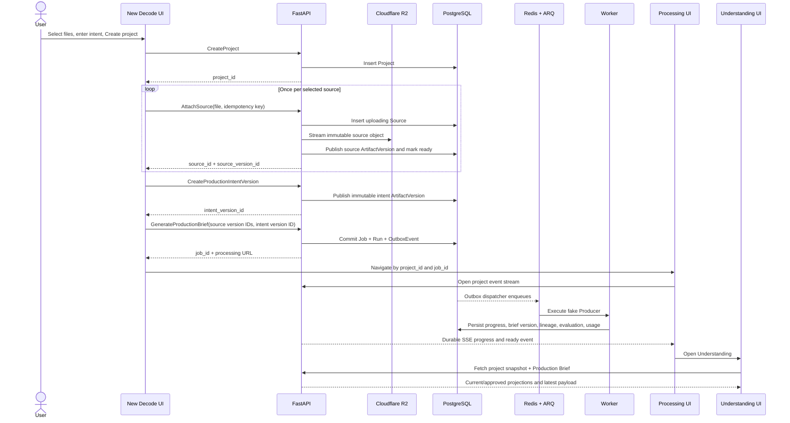

# Decode walking-skeleton UI-to-backend contract

**Status:** Approved for implementation — first V1 implementation milestone only  
**Date:** 2026-08-04  
**Parent plan:** [Decode backend foundation plan](/Users/moinuddinshaik/Downloads/decode/.omc/plans/decode-backend-foundation.md:1)  
**Implementation authorization:** Approved by the user on 2026-08-04 for the walking-skeleton scope defined here.

## 1. Decision and scope

The first V1 implementation milestone—the walking skeleton—will prove one durable path:

```text
Create Project
→ upload one or more sources through one repeatable source command
→ publish Production Intent artifact version
→ create Production Brief Job + Run + OutboxEvent
→ execute deterministic fake Producer through ARQ
→ publish Production Brief artifact version + evaluation + usage
→ stream durable progress
→ edit into a new immutable version
→ approve one exact version
→ view history and lineage
```

The existing visual system remains. The data source and a small number of misleading walking-skeleton interactions change:

- The Dashboard reads real projects and opens a project by ID.
- New Decode keeps its current one-surface composer and multi-source UX.
- Processing consumes durable SSE events instead of timers.
- Understanding displays the Production Brief—not seeded scenes or a future Teaching Plan.
- “Push back” becomes “Edit brief” during this milestone because artifact discussion is deferred. It may return when the real discussion system exists.
- During this milestone, Teaching Plan, Script, Edit, and Export remain visible in the product rail but locked until their own vertical slices are implemented. This is a temporary development state, not the shipped Decode V1 scope.
- Production Room and artifact discussions are separate collaboration capabilities. They may be added after the core video pipeline works and do not block the first walking skeleton.

### Decode V1 private-beta scope

The shipped Decode V1 private beta is the complete core video-production loop, not merely the Production Brief milestone:

```text
Production Brief
→ Teaching Plan
→ Scene Scripts
→ TTS Narration
→ Visual Specifications
→ Scene Preview and Regeneration
→ Timeline Assembly
→ Review
→ Video Export
```

Before the private beta is called Decode V1:

1. Understanding, Teaching Plan, Script, Edit, and Export must all be backed by durable backend artifacts and real commands/queries.
2. TTS narration, scene-level regeneration, preview, timeline assembly, and final export must work end to end.
3. No visible control may operate only on seeded or fake production data.
4. The fake Producer is replaced by a real provider only after the walking skeleton passes.
5. Production Room/discussions may ship later unless separately promoted into the V1 launch criteria; artifact edit, regeneration, approval, and history remain mandatory without them.

The rest of this contract intentionally specifies only the first milestone. Later V1 vertical slices receive their own contracts before implementation.

### V1 delivery sequence

| Slice | Product result | Unlocks |
|---|---|---|
| 1. Walking skeleton | Fake Producer proves project, source, intent, brief, jobs, artifacts, editing, approval, history, and SSE. | Understanding with fixture generation only; not a shippable product. |
| 2. Real Producer | Real source extraction and Production Brief generation/evaluation behind the same contract. | Real Understanding. |
| 3. Director | Teaching Plan artifact, editing, approval, and dependency lineage. | Teaching Plan. |
| 4. Writer and narration | Scene Script artifacts plus ElevenLabs TTS artifacts and measured timing. | Script and real narration. |
| 5. Motion and renderer | Visual Specifications, assets, renderer-port implementation, preview, and scene-level regeneration. | Core Edit workspace and preview. |
| 6. Editor and Publisher | Assembly Timeline, review, resumable export, and final Video artifact. | Export and the complete Decode V1 video loop. |
| 7. Private-beta hardening | Real authentication/authorization, recovery checks, limits, observability, and removal of all seeded production behavior. | Decode V1 private beta. |

Production Room/discussions can be scheduled after Slice 6 unless user testing shows they are necessary for the private-beta experience.

## 2. Evidence from the current UI

| Existing behavior | Evidence | Walking-skeleton interpretation |
|---|---|---|
| The app uses an in-memory screen router. | [Studio.tsx](/Users/moinuddinshaik/Downloads/decode/apps/frontend/src/components/Studio.tsx:11) | Durable projects need URL-addressable project and job IDs so refresh/resume does not depend on Zustand. |
| New Decode deliberately supports multiple sources and pasted text. | [NewDecode.tsx](/Users/moinuddinshaik/Downloads/decode/apps/frontend/src/components/screens/upload/NewDecode.tsx:28) | Keep the UX. Implement one repeatable single-source upload command; the client invokes it per selected source. No batch-upload subsystem. |
| The composer captures creative brief, audience, length, depth, narration style, and optional brand guidance. | [NewDecode.tsx](/Users/moinuddinshaik/Downloads/decode/apps/frontend/src/components/screens/upload/NewDecode.tsx:260) | Persist these as one immutable `production_intent` artifact version. Rename the visible “Voice” field to “Narration style”; do not interpret it as an ElevenLabs voice profile. |
| Create Project currently changes only local Zustand state. | [NewDecode.tsx](/Users/moinuddinshaik/Downloads/decode/apps/frontend/src/components/screens/upload/NewDecode.tsx:412), [studio.ts](/Users/moinuddinshaik/Downloads/decode/apps/frontend/src/store/studio.ts:231) | Replace this action with the explicit project → sources → intent → generation-command sequence. |
| Processing progress is driven by client timers and includes future plan/script/storyboard work. | [Processing.tsx](/Users/moinuddinshaik/Downloads/decode/apps/frontend/src/components/screens/processing/Processing.tsx:57), [api.ts](/Users/moinuddinshaik/Downloads/decode/apps/frontend/src/lib/api.ts:262) | Replace timers with SSE. This milestone’s progress stops at Production Brief publication; later V1 slices add truthful rows for their own work. |
| Understanding is read-only, renders seeded concepts and scenes, and routes pushback to chat. | [Understanding.tsx](/Users/moinuddinshaik/Downloads/decode/apps/frontend/src/components/project/stages/Understanding.tsx:12), [Understanding.tsx](/Users/moinuddinshaik/Downloads/decode/apps/frontend/src/components/project/stages/Understanding.tsx:118) | Render the real Production Brief, add direct edit/history actions, and remove the chat dependency from this stage. |
| The project shell labels itself “Local session · not synced” and derives everything from seeded scenes. | [ProjectShell.tsx](/Users/moinuddinshaik/Downloads/decode/apps/frontend/src/components/project/ProjectShell.tsx:40), [ProjectShell.tsx](/Users/moinuddinshaik/Downloads/decode/apps/frontend/src/components/project/ProjectShell.tsx:171) | Hydrate the shell from the project snapshot. Keep all downstream stages locked during the walking skeleton. |
| Dashboard cards are seeded and all cards open the same in-memory project. | [Dashboard.tsx](/Users/moinuddinshaik/Downloads/decode/apps/frontend/src/components/screens/dashboard/Dashboard.tsx:46), [Dashboard.tsx](/Users/moinuddinshaik/Downloads/decode/apps/frontend/src/components/screens/dashboard/Dashboard.tsx:132) | Query real project summaries and navigate using each project ID. |
| Current frontend types mix transport data, seeded demo data, and future scene-domain data. | [types.ts](/Users/moinuddinshaik/Downloads/decode/apps/frontend/src/lib/types.ts:1) | Add walking-skeleton query/command DTOs without deleting future visual prototype types yet. Zustand retains transient UI state only. |

## 3. Walking-skeleton navigation contract

The current components can be reused, but project identity must live in the URL.

| Surface | Canonical route | Required backend read |
|---|---|---|
| Landing | `/` | None |
| Dashboard | `/studio` | Project list query |
| New Decode | `/studio/new` | None before submission |
| Processing | `/studio/projects/{project_id}/jobs/{job_id}` | Job detail, then project SSE stream |
| Understanding | `/studio/projects/{project_id}/understanding` | Project studio snapshot and Production Brief query |

Rules:

1. Refreshing any project or job route reconstructs the screen from PostgreSQL-backed queries.
2. Zustand may hold unsaved composer fields, open panels, and edit buffers. It must not be authoritative for project, artifact, approval, job, or progress state.
3. A processing URL may be reopened after disconnect. Completed jobs redirect or offer navigation to Understanding; failed jobs show failure and retry.
4. Downstream stages remain visible in the visual rail but are locked only while their backend slices are unimplemented. They unlock incrementally and must all be real before the Decode V1 private beta.

## 4. UI flow



## 5. Command endpoints

All mutating requests require an `Idempotency-Key`. Actor identity is always derived from server request context; clients never submit `actor_id`, `created_by`, approval owner, or run owner.

| Command | Method and route | Request | Success | Important behavior |
|---|---|---|---|---|
| Create Project | `POST /api/v1/projects` | Optional title | `201` Project | Repeating the same idempotency key returns the same project. Initial status is `draft`. |
| Attach Source | `POST /api/v1/projects/{project_id}/sources` | Multipart file plus declared source kind | `201` Source + source artifact/version IDs | One file per request. Pasted text is sent as a UTF-8 text file. Upload streams to R2; no durable bytes remain on Railway disk. |
| Publish Production Intent | `POST /api/v1/projects/{project_id}/production-intent/versions` | Intent payload | `201` ArtifactVersion | Creates or reuses the stable `production_intent` Artifact and advances its latest projection. |
| Generate Production Brief | `POST /api/v1/projects/{project_id}/production-brief/generations` | Exact source version IDs and intent version ID | `202` Job + initial Run | Job, Run, input bindings, and OutboxEvent commit atomically. Does not execute the Producer in the HTTP request. |
| Retry failed Run | `POST /api/v1/projects/{project_id}/jobs/{job_id}/retries` | Expected failed run ID | `202` new Run | Infrastructure retry under the same Job. Reject when the run is not failed or a run is already active. |
| Edit Production Brief | `POST /api/v1/projects/{project_id}/artifacts/{artifact_id}/versions` | `base_version_id`, schema version, complete brief payload | `201` ArtifactVersion | Reject stale base with `409`; never patch or overwrite the old payload. Prior approval remains selected until a new approval. |
| Approve Version | `POST /api/v1/projects/{project_id}/artifacts/{artifact_id}/versions/{version_id}/approvals` | Decision `approved` and optional note | `201` ApprovalDecision + updated projection | Evaluation is visible evidence, not a walking-skeleton approval gate. Approval always names one immutable version. |

This walking-skeleton contract deliberately has no generic “run any department,” “mutate any artifact type,” discussion, checkpoint, credit, render, TTS, or downstream-regeneration endpoint. Later V1 contracts add the specific TTS, scene-regeneration, preview, timeline, and export operations required by the private beta.

## 6. Query endpoints

| Query | Method and route | Used by |
|---|---|---|
| List Projects | `GET /api/v1/projects?limit={n}&cursor={cursor}` | Dashboard |
| Project Studio Snapshot | `GET /api/v1/projects/{project_id}/studio` | Project shell and route recovery |
| Job Detail | `GET /api/v1/projects/{project_id}/jobs/{job_id}` | Processing initial load, refresh, terminal-state recovery |
| Project Event Stream | `GET /api/v1/projects/{project_id}/events/stream` | Processing and later project-wide live updates |
| Production Brief | `GET /api/v1/projects/{project_id}/production-brief` | Understanding |
| Artifact History | `GET /api/v1/projects/{project_id}/artifacts/{artifact_id}/versions?limit={n}&cursor={cursor}` | History drawer/panel |
| Artifact Lineage | `GET /api/v1/projects/{project_id}/artifacts/{artifact_id}/versions/{version_id}/lineage` | History detail; optional in first UI pass but contract is fixed |
| Usage by Job | `GET /api/v1/projects/{project_id}/jobs/{job_id}/usage` | Processing detail and debugging; not a billing UI |

Queries return UI-oriented projections. They do not expose SQLAlchemy models or require the frontend to reconstruct current/approved state from raw rows.

## 7. Payload contracts

### Production Intent schema v1

| Field | Type | Rules |
|---|---|---|
| `creative_brief` | nullable text | Optional user direction; preserve verbatim after surrounding-whitespace normalization. |
| `audience` | text | Required, free text, 1–500 characters. |
| `target_duration_seconds` | nullable integer | `60`, `180`, `300`, or `600` for current fixed options. Null only when `runtime_mode` is `deep_dive`. |
| `runtime_mode` | enum | `fixed` or `deep_dive`. |
| `depth` | enum | `intuition_first`, `balanced`, `rigorous`. |
| `narration_style` | enum | `professional`, `friendly`, `storyteller`. This is not a TTS voice ID. |
| `brand.colors` | list of text | Optional; normalized but not interpreted by the walking-skeleton fake Producer. |
| `brand.fonts` | nullable text | Optional. |
| `brand.guidelines` | nullable text | Optional. |

Brand settings stay inside Production Intent during the first video pipeline. Extract a Brand artifact only when brand reuse across projects becomes real.

### Production Brief schema v1

| Field | Type | Purpose |
|---|---|---|
| `title` | text | Human-readable working title. |
| `summary` | text | What the source teaches and the intended educational treatment. |
| `audience_profile` | text | Producer’s interpretation of the requested audience. |
| `learning_objectives` | ordered list of text | What the learner should understand or be able to explain. |
| `key_concepts` | ordered list of `{name, importance}` | Concepts selected for instruction; `importance` is `core` or `supporting`. |
| `prerequisites` | ordered list of text | Knowledge the lesson may assume. |
| `scope_in` | ordered list of text | Included subject boundaries. |
| `scope_out` | ordered list of text | Deliberately excluded material. |
| `teaching_opportunities` | ordered list of `{title, rationale}` | Analogies, worked examples, contrasts, or demonstrations worth considering later. |
| `source_findings` | object | Counts/notes derived from inputs when known; walking-skeleton fake values are clearly identified as fixture data. |
| `open_questions` | ordered list of text | Ambiguities requiring eventual human or department attention; may be empty. |

The Production Brief does not contain scenes, narration, a Teaching Plan, visual prompts, timeline entries, or renderer data.

### Artifact version projection

| Field | Meaning |
|---|---|
| `artifact_id` | Stable artifact identity. |
| `version_id` | Immutable version identity. |
| `sequence` | Monotonic integer within the artifact. |
| `artifact_type` | `source`, `production_intent`, or `production_brief` in this milestone. Later V1 slices extend the registry. |
| `schema_version` | Payload schema version, initially `1`. |
| `payload` or `blob_manifest` | Typed structured content or R2 object metadata. |
| `content_hash` | Canonical payload/manifest hash. |
| `parent_bindings` | Exact input version IDs with roles such as `source` and `production_intent`. |
| `owner_role` | `producer` for Production Brief; `user` for user-created intent/source. |
| `created_by` | Server-derived actor or run identity. |
| `created_at` | Server timestamp. |
| `run_id` | Producing Run when generated; null for direct user versions. |
| `supersedes_version_id` | Previous version where applicable. |
| `rationale` | Concise explanation; never hidden chain-of-thought. |

### Current and approved projections

Every artifact query returns:

| Field | Meaning |
|---|---|
| `latest_version_id` | Newest saved or generated version. |
| `approved_version_id` | Most recently selected approved version, nullable. |
| `latest_is_approved` | Derived convenience flag. |
| `latest_evaluation` | Most recent evaluation summary associated with latest version, nullable. |

Saving an edit moves only `latest_version_id`. Approving moves only `approved_version_id` and records an immutable ApprovalDecision.

### Evaluation schema v1

| Field | Type |
|---|---|
| `evaluation_id` | UUID |
| `artifact_version_id` | UUID |
| `evaluator` | Fake evaluator identifier/version |
| `decision` | `pass`, `needs_attention`, or `unable_to_evaluate` |
| `checks` | Ordered list of named check, outcome, and concise evidence |
| `summary` | Concise text shown to the human |
| `created_at` | Server timestamp |

No automatic revision follows any decision. All three outcomes proceed to human review.

### Usage record schema v1

| Field | Type |
|---|---|
| `provider` | Text; `fake` in the walking skeleton |
| `operation` | `production_brief_generation` or `production_brief_evaluation` |
| `model` | Nullable provider model/fixture identifier |
| `input_tokens` / `output_tokens` | Nullable integers |
| `duration_ms` | Nullable integer |
| `estimated_cost_usd` | Decimal string; `0` for deterministic fake operations |
| `run_id` / `artifact_version_id` | Associated durable IDs |

There are no credits, balances, debits, invoices, pricing tiers, or entitlement rules in the walking-skeleton milestone. Usage tracking remains part of later V1 slices; billing can follow product validation.

## 8. Job and progress contract

### Job projection

| Field | Values/meaning |
|---|---|
| `job_id` | Stable requested outcome identity. |
| `kind` | `generate_production_brief`. |
| `status` | `queued`, `running`, `succeeded`, `failed`. |
| `active_run_id` | Current attempt, nullable in malformed/recoverable states. |
| `requested_input_versions` | Exact source and intent version IDs. |
| `result_artifact_version_id` | Published brief version on success. |
| `failure` | Nullable safe error code/message/retryable flag. |
| `created_at`, `started_at`, `finished_at` | Server timestamps. |

### SSE envelope

Every event has:

- Monotonic durable `id` used as the SSE event ID.
- `type`.
- `project_id`.
- Nullable `job_id`, `run_id`, `artifact_id`, and `artifact_version_id`.
- `occurred_at` server timestamp.
- Type-specific `data` containing display-safe summaries only.

The server honors the browser’s `Last-Event-ID` on reconnect. SSE is a delivery mechanism, not the source of truth; the client refetches Job Detail or the Studio Snapshot after terminal events.

### Walking-skeleton event-to-UI mapping

| Event type | Processing row/status | UI action |
|---|---|---|
| `job.queued` | “Producer queued” | Show waiting state. |
| `run.started` | “Preparing focused context” | Mark first row active. |
| `run.progress` with `reading_sources` | “Reading source material” | Show source count and bytes/metadata handled. |
| `run.progress` with `generating_brief` | “Drafting Production Brief” | Mark generation active. |
| `run.progress` with `evaluating_brief` | “Evaluating Production Brief” | Show evaluation active. |
| `artifact.version.created` | “Publishing immutable artifact” | Do not render payload from the event; wait for ready/terminal event. |
| `artifact.ready_for_review` | “Production Brief ready for review” | Enable Open project. |
| `run.failed` | Failure summary | Show Retry when `retryable=true`; never advance on a timer. |
| `job.succeeded` | Complete | Refetch job/project and enable navigation. |

During this milestone, the current seven-row checklist must not claim to plan lessons, draft scripts, or prepare storyboards. Those rows return as real departments are added in later V1 slices.

## 9. Production Brief edit, approval, and history

```mermaid
sequenceDiagram
    actor U as User
    participant UI as Understanding UI
    participant API as FastAPI
    participant DB as PostgreSQL

    UI->>API: Get Production Brief
    API-->>UI: artifact + latest v1 + approved null + evaluation
    U->>UI: Edit brief
    UI->>API: Create version(base_version_id=v1, full payload)
    API->>DB: Verify latest is v1
    API->>DB: Insert immutable v2 and move latest projection
    API-->>UI: v2 latest; approved remains null

    U->>UI: Approve v2
    UI->>API: Approve exact version v2
    API->>DB: Insert ApprovalDecision and move approved projection
    API-->>UI: v2 latest and approved

    U->>UI: Edit approved v2
    UI->>API: Create version(base_version_id=v2)
    API->>DB: Insert v3 and move latest only
    API-->>UI: v3 latest; v2 still approved

    U->>UI: Open history
    UI->>API: List versions
    API-->>UI: v3 latest, v2 approved, v1 generated + lineage
```

Walking-skeleton editing rules:

1. Edit mode starts from the full latest payload and saves a complete replacement payload.
2. The UI stores the loaded `base_version_id` with the edit buffer.
3. `409 artifact_version_conflict` returns the current latest version ID and does not merge silently.
4. Unsaved changes remain local and are never represented as an ArtifactVersion.
5. Approval is available for the version currently being viewed. The UI must state clearly when that version is not latest.
6. Approval does not automatically start Teaching Plan generation in the walking skeleton.

## 10. Minimal Understanding-screen adaptation

Keep the existing visual language and Handoff layout, but change the content contract:

| Existing region | Walking-skeleton content |
|---|---|
| Header | Project title plus Production Brief summary. |
| Stats | Core concept count, audience, target runtime, source count. No scene count. |
| Producer HandoffBrief | Artifact rationale and evaluation summary. |
| Concepts section | `key_concepts`, visibly distinguishing core/supporting. |
| Current scene list | Replace with learning objectives, prerequisites, scope in/out, teaching opportunities, and open questions. |
| “Push back” | “Edit brief”; opens direct artifact edit mode. |
| Approve | Approves the exact viewed version. |
| Stage metadata | Version number, latest/approved markers, evaluation decision, History action. |

Teaching Plan remains locked after approval only until the Director vertical slice is implemented. The milestone approval receipt says “Production Brief approved” rather than falsely claiming Director work has started. Before Decode V1 ships, approval must truthfully hand off to a real Teaching Plan job.

## 11. Studio snapshot

The project shell should load one projection containing only information needed to render the shell and route correctly:

| Field | Use |
|---|---|
| Project ID, title, status, created/updated timestamps | Header and recovery. |
| Source summaries | Rail/footer and source count. |
| Current stage | `processing` or `understanding` in this milestone; later V1 slices add the remaining stages. |
| Active/most recent Job summary | Resume processing or show failure. |
| Artifact summaries | Latest/approved IDs and readiness for Production Intent and Production Brief. |
| Allowed actions | Server-derived booleans such as `can_generate_brief`, `can_edit_brief`, `can_approve_brief`, `can_retry_job`. |

The frontend must not derive authorization or workflow permission solely from local approval booleans. It may derive display labels from returned projections.

## 12. Error contract

All command/query failures use one problem response with:

- Stable `code` suitable for UI behavior.
- HTTP status.
- Safe human-readable `detail`.
- `request_id` for support/debugging.
- `retryable` boolean.
- Optional field errors.
- Conflict metadata such as `current_latest_version_id` when applicable.

Required walking-skeleton cases:

| Status | Code | UI behavior |
|---:|---|---|
| 400 | `invalid_command` | Show form-level message. |
| 404 | `project_not_found`, `artifact_not_found`, `job_not_found` | Offer return to Dashboard. |
| 409 | `idempotency_conflict` | Explain that the key was reused for different input. |
| 409 | `artifact_version_conflict` | Keep edit buffer; offer reload current version. |
| 409 | `run_already_active` | Reopen the active job instead of creating another attempt. |
| 413 | `source_too_large` | Keep other composer state and identify the rejected file. |
| 415 | `unsupported_source_type` | Identify supported source types. |
| 422 | `validation_failed` | Bind errors to Production Intent or Brief fields. |
| 503 | `object_store_unavailable`, `queue_unavailable` | Keep the draft project and allow safe retry with the same idempotency key. |

## 13. Walking-skeleton actor and security boundary

The walking skeleton may use a configured single internal actor provider, but:

1. Actor identity is injected through a request-context interface.
2. Domain/application code never reads Railway, Supabase, Neon, or a specific JWT claim format.
3. Approval records always contain the server-derived actor ID.
4. Railway API CORS is restricted to the deployed frontend origin.
5. The app must not be opened to untrusted multi-user access until a real authentication and project-authorization adapter exists.

This keeps authentication small without baking “anonymous forever” into the domain.

## 14. Frontend change map for implementation

This is a future implementation map, not an instruction to edit now.

| File/surface | Required change | Keep |
|---|---|---|
| [page.tsx](/Users/moinuddinshaik/Downloads/decode/apps/frontend/src/app/page.tsx:1) and app routing | Introduce durable studio/project/job routes. | Existing screen components and visual design. |
| [api.ts](/Users/moinuddinshaik/Downloads/decode/apps/frontend/src/lib/api.ts:1) | Replace seed-producing functions for the first connected surfaces with a typed HTTP/SSE client. Seed scene content may remain development-only until each future stage is connected. | Single frontend data seam. |
| [types.ts](/Users/moinuddinshaik/Downloads/decode/apps/frontend/src/lib/types.ts:1) | Add walking-skeleton command/query DTOs and separate them from prototype scene types. | Frontend-owned view types when they are truly presentation-specific. |
| [studio.ts](/Users/moinuddinshaik/Downloads/decode/apps/frontend/src/store/studio.ts:29) | Keep transient composer, selection, edit-buffer, and panel state; remove project/artifact/job authority from Zustand. | Zustand for local interaction state. |
| [Dashboard.tsx](/Users/moinuddinshaik/Downloads/decode/apps/frontend/src/components/screens/dashboard/Dashboard.tsx:26) | Load Project summaries and navigate by ID. | Card layout and local search initially. |
| [NewDecode.tsx](/Users/moinuddinshaik/Downloads/decode/apps/frontend/src/components/screens/upload/NewDecode.tsx:45) | Execute project/source/intent/generation sequence with per-file failure feedback. Rename Voice to Narration style. | One-surface composer, multiple source selection, pasted text, optional brand inputs. |
| [Processing.tsx](/Users/moinuddinshaik/Downloads/decode/apps/frontend/src/components/screens/processing/Processing.tsx:28) | Replace timers with Job query + SSE and milestone-accurate progress labels. | Named checklist, source/intent summary, no bare spinner. |
| [Understanding.tsx](/Users/moinuddinshaik/Downloads/decode/apps/frontend/src/components/project/stages/Understanding.tsx:19) | Render/edit/approve/history for Production Brief; remove scene dependency. | Producer ownership, stat cards, handoff visual language. |
| [HandoffCard.tsx](/Users/moinuddinshaik/Downloads/decode/apps/frontend/src/components/crew/HandoffCard.tsx:117) | Make the secondary-action label configurable so the walking skeleton can say Edit brief. | Sticky reachable approval decision. |
| [ProjectShell.tsx](/Users/moinuddinshaik/Downloads/decode/apps/frontend/src/components/project/ProjectShell.tsx:40) | Hydrate from Studio Snapshot, remove “Local session,” and unlock stages as their real vertical slices land. | Five-stage product vocabulary remains visible throughout. |
| Production Room and Command Palette | During the walking skeleton, hide or disable only commands that would pretend discussion/mutation exists. Re-enable them when backed by real contracts. | Components remain available for later discussion work. |

## 15. Acceptance criteria for the walking-skeleton contract

1. Every active walking-skeleton UI action maps to exactly one command/query or one explicitly documented client-side command sequence.
2. Every mutation has an idempotency rule and a named success resource.
3. Project/job routes survive browser refresh without Zustand project state.
4. The Create Project action cannot enqueue work until every selected source is ready and the exact Production Intent version exists.
5. Multi-source support is implemented by repeating one source command; no batch-upload subsystem is required.
6. Production Brief generation binds exact source and intent version IDs.
7. Processing progress is derived only from Job query/SSE state and stops at Production Brief.
8. Production Brief payload contains no Teaching Plan, scenes, script, timeline, TTS, or renderer data.
9. Edit creates a full immutable version against an explicit base version.
10. Approval names one exact version and does not move when a later edit is saved.
11. History can distinguish generated, edited, latest, and approved versions.
12. Evaluation evidence is visible but does not automatically revise or gate approval.
13. Usage records contain raw provider facts and estimated cost only.
14. Discussion, checkpoint, credit, TTS, renderer, and downstream department endpoints are absent.
15. During this milestone, the UI makes no claim that Teaching Plan generation began after Production Brief approval; the Director slice replaces this temporary behavior before Decode V1 ships.
16. All server-authoritative state can be reconstructed from PostgreSQL/R2 after frontend refresh and Redis loss.
17. No request body supplies trusted actor/owner identity.
18. Contracts contain no Railway-, Supabase-, Neon-, ElevenLabs-, or HyperFrames-specific domain type.

## 16. Implementation order after approval

1. Freeze the artifact payload schemas and command/query names in this document.
2. Define backend persistence and migrations for only the walking-skeleton entities.
3. Implement synchronous project/source/intent/edit/approval/history paths.
4. Implement Job/Run/OutboxEvent, dispatcher, ARQ fake Producer, evaluation, usage, and durable progress.
5. Add the frontend API seam and route identity.
6. Connect New Decode and Processing.
7. Adapt Understanding for brief edit/approval/history.
8. Connect Dashboard and validate refresh/resume.
9. Deploy API and worker separately on Railway and run the end-to-end verification set.
10. Stop. Review evidence before adding a real model provider.

## 17. Remaining deployment decision

Only one product/security choice remains deliberately unresolved: the mechanism that protects the private beta before full authentication exists. The domain contract is unaffected; the deployment must not be publicly writable without a trusted actor boundary.
