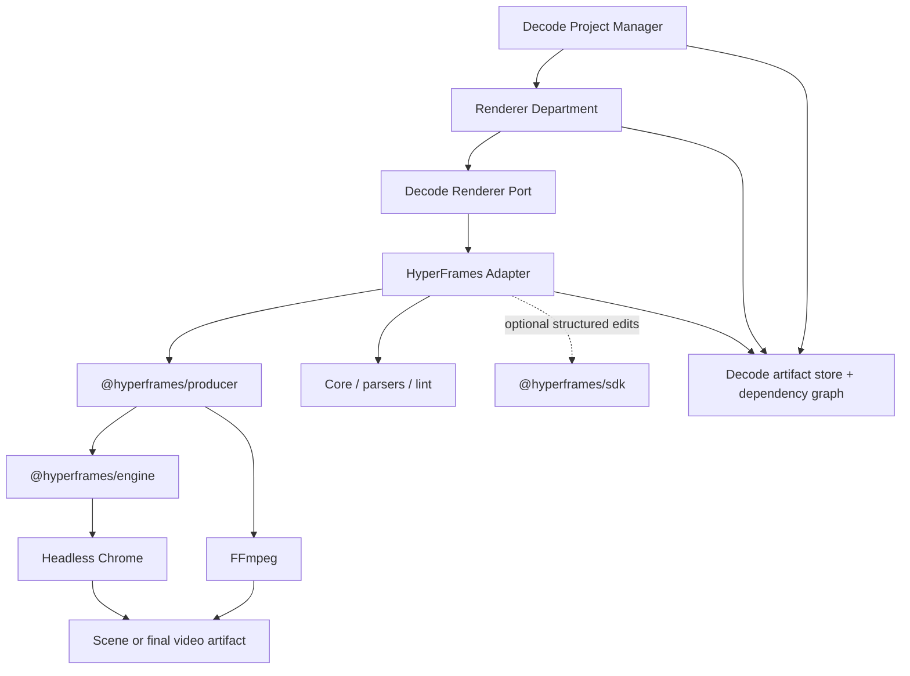
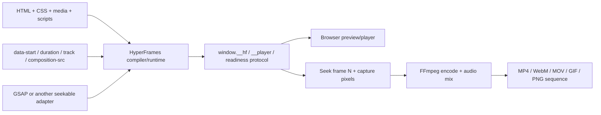
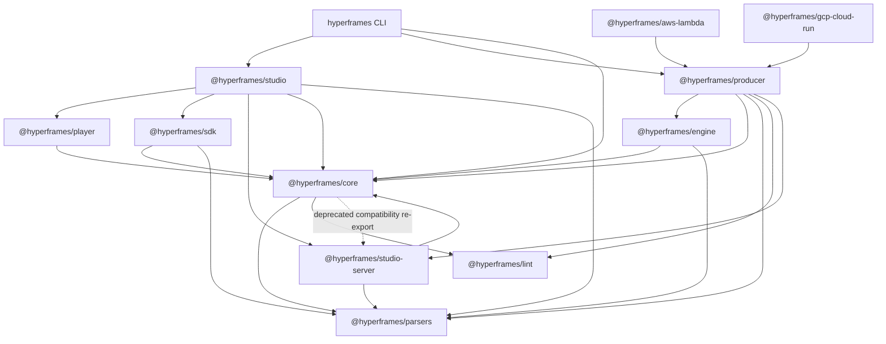
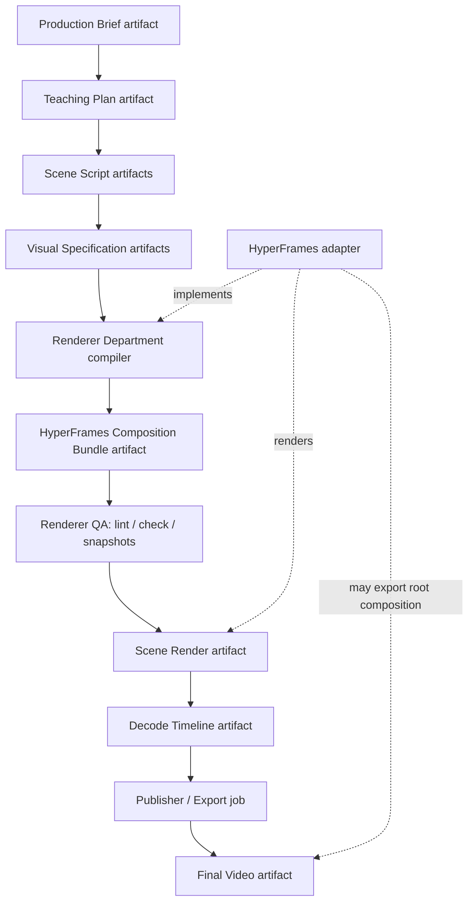
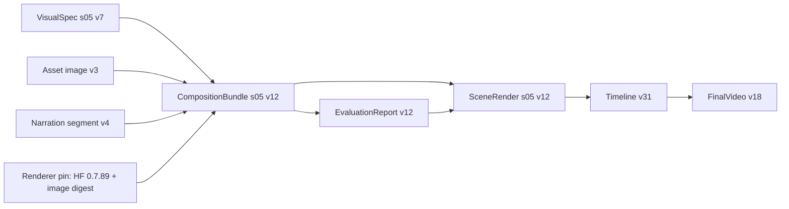
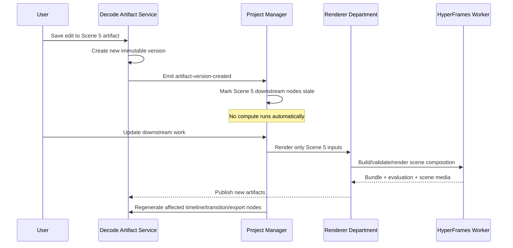

# HyperFrames architecture review for Decode

**Status:** Architecture recommendation — no integration work performed  
**Decision:** Conditional adoption, behind a Decode-owned renderer boundary  
**Review date:** 2026-08-03  
**HyperFrames source reviewed:** `heygen-com/hyperframes` at commit `411ada0d902349e1663bb5459c611f18449527fb` (2026-08-02), package version `0.7.89`

## Executive recommendation

Decode should adopt HyperFrames as a **replaceable rendering substrate inside the Renderer Department**, not as Decode's application framework, workflow engine, project model, or canonical artifact model.

The correct topology is a stricter version of option B:



The main architectural rule is:

> Decode artifacts are authoritative. HyperFrames compositions are derived, executable render artifacts.

This preserves Decode's ability to change rendering technology later, keeps educational and workflow concepts out of renderer-specific HTML, and prevents HyperFrames' file-centric editor model from becoming Decode's system of record.

### Bottom line

- **Adopt:** `@hyperframes/producer` inside isolated render workers; selected `core`/`parsers`/`lint` APIs inside the adapter; `@hyperframes/player` for composition preview where useful.
- **Evaluate later:** `@hyperframes/sdk` for structured scene-composition editing and patch capture; cloud distributed adapters after the local contract is stable.
- **Do not make foundational:** `@hyperframes/studio`, the built-in producer HTTP server, the HyperFrames seven-step product workflow, or its router/creation agent skills.
- **Do not import HyperFrames into Decode domain modules.** Only the renderer adapter should know its types, HTML schema, runtime globals, or package versions.
- **Do not claim complete incremental video regeneration from HyperFrames alone.** Scene source can regenerate independently; a master render still recaptures the final timeline unless Decode introduces segment caching and assembly.

## Scope and evidence

This review examined:

- Official concepts, package docs, rendering, timeline editing, deployment, prompt, and skills documentation.
- The repository package graph and manifests.
- Core runtime/protocol, parsers, compiler, variables, linter, frame adapters, and HTML generation surfaces.
- Engine browser management, frame capture, media extraction/injection, encoding, audio, worker coordination, and URL handling.
- Producer orchestration, render jobs, standalone sub-composition rendering, distributed plan/chunk/assemble primitives, server routes, artifact transactions, and observability.
- Studio React exports, file I/O, optimistic concurrency, IndexedDB edit history, preview bridge, timeline mutation, and SDK migration paths.
- SDK patch, override, persistence, version, undo/redo, and preview adapter models.
- CLI command surface, registry, examples, skills, and regression fixtures.
- Decode's local product principles and planned department boundaries in `PROJECT_CONTEXT.md`, `MASTER.md`, and `APP-STRUCTURE.md`.

The source is materially ahead of some overview documentation. This document therefore treats repository source at the reviewed commit as authoritative when it conflicts with older package prose.

---

## 1. What exactly is HyperFrames?

HyperFrames is an **HTML composition system plus deterministic browser-to-video toolchain**.

Its primary abstraction is not “an AI-generated video.” It is an executable HTML document whose temporal structure is declared with `data-*` attributes and whose animation state can be deterministically sought to any frame. HyperFrames then previews that document in a browser or captures it frame-by-frame and encodes it as video.

The official definition is an open-source framework for turning HTML, CSS, media, and seekable animations into deterministic video. A composition is an HTML document defining a timeline; nested compositions provide reusable temporal units. See [Introduction](https://hyperframes.heygen.com/introduction), [Compositions](https://hyperframes.heygen.com/concepts/compositions), and [Deterministic Rendering](https://hyperframes.heygen.com/concepts/determinism).

### Classification

| Question | Answer | Boundary |
|---|---|---|
| Rendering engine? | **Yes.** | `@hyperframes/engine` seeks pages and captures frames; `@hyperframes/producer` turns the captures into finished media. |
| HTML runtime? | **Yes.** | The core runtime owns playback, seeking, timed clip lifecycle, variables, nested timelines, readiness, and the parent/iframe protocol. |
| AI framework? | **No, not at runtime.** | It ships agent skills, prompt guides, and file-based creation workflows. These teach agents how to author HyperFrames; they are not a model router, durable agent scheduler, artifact database, or evaluation platform. |
| Editor? | **Yes, but narrowly.** | Studio is a browser NLE/source editor for HyperFrames files. It is not a collaborative production-management application. |
| Composition system? | **Yes; this is the center of gravity.** | HTML elements, media, nested compositions, variables, tracks, timing attributes, and seekable animation form an executable composition graph. |

### Runtime boundary



The engine's actual page contract is small: duration, deterministic `seek(time)`, and optional media/transition metadata. That is why GSAP, CSS, Canvas, WebGL, Lottie, Three.js, or another animation runtime can participate if it can answer “what should the page look like at frame N?” The public Frame Adapter API is explicitly v0/experimental even though seek-by-frame is stable. See [Frame Adapters](https://hyperframes.heygen.com/concepts/frame-adapters) and the [engine protocol source at the reviewed commit](https://github.com/heygen-com/hyperframes/blob/411ada0d902349e1663bb5459c611f18449527fb/packages/engine/src/types.ts).

### What HyperFrames is not

HyperFrames does not provide:

- A project/tenant model.
- A durable workflow or department orchestrator.
- A versioned artifact dependency graph.
- Multi-user collaboration semantics.
- Pedagogical planning, factual review, or learning evaluation.
- AI cost accounting or user credit logic.
- A general learning-content domain model.
- Cross-version incremental final-video caching.

Those absences are not defects in a renderer; they define the integration boundary.

---

## 2. Problems solved and unsolved

### Problems HyperFrames solves well

1. **Deterministic HTML-to-video capture.** Each output frame is sought independently rather than screen-recorded in real time. Chrome capture and FFmpeg encoding are already integrated.
2. **Preview/render runtime parity.** Studio and Player use the same runtime contract that Producer drives for rendering.
3. **Framework-neutral visual authoring.** Plain HTML/CSS/JS avoids requiring a React composition model and is friendly to AI code-generation agents.
4. **Nested, reusable visual units.** External sub-compositions isolate scenes/blocks and can be instantiated with variables.
5. **Media handling.** Video frame extraction/injection, audio extraction/mixing, volume and offsets, remote media localization, fonts, GIFs, transparency, and HDR/local rendering paths are substantial solved infrastructure.
6. **Render orchestration inside one job.** Compile, browser probe, video extraction, audio processing, capture, encode, assemble, cleanup, cancellation, retries, warnings, and detailed performance telemetry are present.
7. **Local and distributed execution primitives.** Producer includes plan/chunk/assemble; AWS Lambda and GCP Cloud Run packages supply cloud adapters.
8. **Developer and agent workflow.** CLI commands cover initialization, preview, lint/check, snapshots, rendering, media preprocessing, catalog use, and diagnostics.
9. **Basic visual editing.** Studio can select and edit elements, modify source, move/trim clips, edit keyframes, and write supported changes back to HTML.
10. **Reusable visual catalog.** Blocks, components, transitions, and examples can seed a Decode visual library.

### Problems HyperFrames does not solve for Decode

1. **Educational production semantics.** It has no concept of a teaching objective, prerequisite, explanation strategy, misconception, evidence citation, or pedagogical quality.
2. **Decode's artifact graph.** HyperFrames files are inspectable, but they do not intrinsically carry Decode's parent artifact IDs, dependency edges, ownership, approval state, compute cost, or staleness state.
3. **Durable job control.** Producer's built-in server uses an in-memory semaphore, blocking/SSE requests, and short-lived output tokens; it is not a durable queue or recovery system.
4. **Collaborative editing.** ETags/optimistic writes and local undo history are not CRDT/OT, presence, comments, review branches, or conflict-resolution UX.
5. **Final-output incrementality.** Editing a sub-composition avoids rebuilding other sub-composition source files. It does not automatically reuse unchanged frames or prior scene encodes during a new root render.
6. **Security isolation for generated executable content.** AI-authored HTML/JS must be treated as untrusted. HyperFrames contains useful URL guards, but Decode still needs a hard compute/network sandbox.
7. **Platform operations.** Authentication, tenancy, quotas, billing, retention, artifact storage, audit logs, webhook policy, and incident controls remain Decode concerns.
8. **Cross-format learning products.** Video and slideshow/deck workflows exist; quizzes, lessons, flashcards, and podcasts are not first-class HyperFrames domains.

---

## 3. Existing abstractions

| Abstraction | What HyperFrames provides | Architectural interpretation for Decode |
|---|---|---|
| Composition | HTML document/root with identity, size, duration, variables, clips, scripts, and nested compositions. | Executable render artifact, not a Decode project or visual specification. |
| Scene | No special canonical `Scene` domain object. A scene/beat is conventionally an external sub-composition. | Map one Decode `scene_id` to one external sub-composition artifact. Keep the Decode scene schema authoritative. |
| Timeline | `data-start`, `data-duration`, `data-track-index`, playback offsets/rates, relative timing, and nesting. | Treat as a projection of Decode's editorial timeline into a render-unit timeline. |
| Rendering | Engine capture plus Producer compile/probe/extract/audio/capture/encode/assemble. | Strong candidate to replace Decode's planned low-level renderer/export implementation. |
| Preview | Core runtime, Player web component, Studio iframe bridge, play/pause/seek/frame-step. | Use runtime/Player behind Decode UI; Decode owns review state and user workflow. |
| Assets | Project-local files, remote localization, media probes, registry assets, font handling, catalog install. | Runtime asset consumption is solved; DAM, provenance, licensing, dedupe, retention, and access control are not. |
| Editor | Studio React application/components; SDK headless editing APIs. | SDK is a better integration seam than adopting Studio wholesale. Studio is best as an internal/advanced tool. |
| Agent tooling | Router, workflow skills, domain skills, prompt guides, agent-friendly CLI. | Reuse narrow renderer-domain skills; do not let its router replace Decode's Project Manager. |
| Reusable components | Registry blocks/components/examples and shader transitions. | Valuable seed for a Decode-owned, version-pinned educational visual component catalog. |
| Evaluation | Static lint, browser checks, layout/motion/contrast inspection, snapshots, comparisons, render warnings and diagnostics. | Good renderer QA sub-gates; insufficient for teaching, factual, continuity, brand, and accessibility approval. |
| Prompts | Prompting guides and skill instructions stored as files. | Useful reference material, not a prompt registry/evaluation/versioning service. Decode should version any adopted prompts itself. |
| Variables | Typed primitive declarations and per-instance or render-time overrides. | Good for reusable visual templates; not a general artifact schema. Root duration/dimensions remain compile-time concerns. |
| Structured editing | SDK stable IDs, typed mutations, JSON patches, sparse overrides, undo/redo, pluggable persistence. | Promising for renderer-specific manual overrides while Decode retains history and collaboration. |
| Distributed rendering | Producer plan/chunk/assemble plus AWS/GCP wrappers. | Can replace frame-distribution mechanics, not Decode's top-level durable job or cost ledger. |

### Composition model details

A practical multi-scene project is a root `index.html` with external scene hosts. Each host points to `compositions/<scene>.html`, has start/duration/track metadata, and can receive per-instance variables. Scene files contain their own markup, styles, scripts, and registered paused timelines. See [Data Attributes](https://hyperframes.heygen.com/concepts/data-attributes) and [Variables](https://hyperframes.heygen.com/concepts/variables).

Important constraints:

- Relative timing references resolve only within the same parent composition.
- Same-track clips cannot overlap.
- Track index is temporal grouping; CSS `z-index` determines visual stacking, although Studio persists row order into inline `z-index`.
- Root duration, width, and height are read at compile time. Root duration cannot safely be changed through a render variable; the source must be regenerated.
- Generic DOM/motion clips lack true front-trim/slip semantics. Studio supports move/right-trim and media start-trim, but not a complete NLE edit model.

### What the examples and skills reveal

The repository's examples are evidence of a **visual primitive ecosystem**, not a reference architecture for a production studio:

- Registry examples span editorial graphics, charts, decision trees, code visuals, slides, kinetic type, product promos, maps, and WebGL effects. This is useful breadth for educational scenes and suggests that a Decode visual catalog can grow without changing the runtime.
- Blocks are installed as source and assets rather than opaque hosted widgets. Decode can therefore inspect, pin, evaluate, and vendor approved components as versioned renderer inputs.
- The deployment examples focus on Kubernetes jobs, AWS Lambda, and GCP Cloud Run. They demonstrate execution patterns, but do not include the durable control-plane concerns Decode needs.
- The 19 reviewed agent skills divide into a router, end-to-end video workflows, migration/creative workflows, and narrow domain skills. The narrow skills are reusable inside Renderer; the router and end-to-end workflows overlap Decode's department orchestration.
- Regression fixtures exercise nested compositions, storyboard-shaped projects, timeline virtualization, video grids, GSAP-heavy pages, and local/distributed parity. These are a stronger maturity signal than the polished catalog demos, but they still do not prove Decode-specific workload or security requirements.

See the [registry examples at the reviewed commit](https://github.com/heygen-com/hyperframes/tree/411ada0d902349e1663bb5459c611f18449527fb/registry/examples), [skills at the reviewed commit](https://github.com/heygen-com/hyperframes/tree/411ada0d902349e1663bb5459c611f18449527fb/skills), and [deployment examples at the reviewed commit](https://github.com/heygen-com/hyperframes/tree/411ada0d902349e1663bb5459c611f18449527fb/examples).

---

## 4. Package architecture and recommendations

### Current package dependency shape



The Core/Studio Server cycle is a documented temporary compatibility cycle in the repository's own [cycle-check script at the reviewed commit](https://github.com/heygen-com/hyperframes/blob/411ada0d902349e1663bb5459c611f18449527fb/scripts/check-package-cycles.mjs). This is a reason to keep dependency use narrow and pinned.

### Package decision table

| Package/tool | What it does | Decode recommendation |
|---|---|---|
| `@hyperframes/producer` | High-level render job: compile, probe, media extraction, audio, capture, encode, assemble, retries, cancellation, warnings, telemetry. | **Use.** Primary production dependency inside renderer workers. Call the library directly behind Decode's durable job system. |
| `@hyperframes/engine` | Low-level browser acquisition, seek/capture, media extraction/injection, encoding helpers, audio mixer, parallel frame coordination. | **Do not call directly initially.** Consume transitively through Producer. Revisit only for custom thumbnail/frame services or a non-FFmpeg encoder. |
| `@hyperframes/core` | Types, runtime, HTML compiler/generator, variables, adapters, linter re-exports, runtime utilities. | **Use only inside the adapter where necessary.** Prefer narrower `parsers`/`lint` entry points for tooling. Never expose Core types in Decode artifacts or domain APIs. |
| `@hyperframes/parsers` | HTML/GSAP parsing and composition types. | **Use selectively** for validation/metadata extraction if Core is unnecessarily broad. Pin with Producer's version. |
| `@hyperframes/lint` | Standalone composition linter. | **Use** as a renderer preflight and CI gate. Store results as Decode evaluation artifacts. |
| `@hyperframes/sdk` | Headless composition editing, stable element IDs, typed mutations, JSON patches, overrides, undo/redo, persistence/preview adapters. | **Evaluate in a second phase.** It is the right seam for advanced scene edits, but Decode must own patch history, permissions, and artifact publication. |
| `@hyperframes/player` | Embeddable composition player with browser controls and events. | **Use for preview experiments.** Prefer it over embedding the full Studio when Decode only needs play/seek/review. Apply stricter origin and iframe isolation than the default same-origin setup. |
| `@hyperframes/studio` | React 19 visual/source editor with preview, file tree, property panels, timeline, keyframes, captions, local history, and render queue UI. | **Do not use as Decode's primary editor.** Consider as an internal motion-design tool or a separately mounted advanced editor after an integration spike. |
| `@hyperframes/studio-server` | Mountable Hono file/preview/editor backend using a storage/bundle/lint adapter. | **Do not adopt initially.** Decode's artifact API should remain canonical. Use only if an embedded Studio pilot requires it. |
| CLI (`hyperframes`) | Init, catalog, preview/play, lint/check, inspect/layout/keyframes, snapshot, render, capture, media tools, skills, doctor, cloud deployment. | **Use for local renderer development and CI diagnostics, not as the production API.** |
| Agent skills | File-based router, creation workflows, and atomic domain skills. | **Curate, vendor, and version only domain skills** used inside Renderer. Avoid the top-level router and end-to-end creation workflows because they overlap Decode departments. |
| `@hyperframes/shader-transitions` | WebGL transitions and transition metadata. | **Optional.** Adopt only behind a transition artifact contract. |
| AWS/GCP packages | Distributed plan/chunk/assemble adapters and infrastructure helpers. | **Later-stage option.** Useful execution plane, but not a replacement for Decode scheduling, billing, or artifact publication. |

### Why not Studio as the foundation?

Studio is capable, but its source reveals an editor optimized around project files and direct mutation of composition HTML:

- React 19 and Zustand peer requirements constrain the host.
- It assumes a HyperFrames project/file API and rewrites source files.
- Its persistent undo stack defaults to browser IndexedDB, while SDK filesystem history is bounded local snapshots.
- It uses optimistic ETag-style conflict detection, not collaborative document semantics.
- Its public export surface is much smaller than the full internal application surface.
- It owns video-editor interaction concepts that overlap Decode's already-designed teaching/script/visual artifact experience.

Embedding it wholesale would create two products inside one shell and two competing sources of truth. Decode should instead use Player/runtime for preview and selectively borrow SDK editing capabilities.

---

## 5. Where HyperFrames should sit inside Decode

### Recommended architecture: renderer plugin behind a port



This is option B plus an explicit adapter/port. The extra layer matters because it prevents five kinds of leakage:

1. HyperFrames data attributes do not become Decode's timeline API.
2. HTML file paths do not become artifact identities.
3. Render job statuses do not become the global workflow state machine.
4. Studio history does not become project version history.
5. A future Remotion/native/canvas renderer can implement the same renderer contract.

### Renderer port responsibilities

The Decode-owned port should conceptually accept immutable inputs and return immutable output manifests:

- Scene visual specification version.
- Asset artifact IDs/content hashes and signed read handles.
- Render profile: resolution, exact FPS, format, quality, color/alpha policy.
- Renderer implementation/version/container digest.
- Optional prior manual renderer override artifact.

It should return:

- Composition bundle artifact.
- Validation/evaluation artifact.
- Preview/snapshot artifacts.
- Scene/final media artifact.
- Render warnings, stage timings, frame counts, peak resource usage, and cost inputs.
- Exact input hashes and parent artifact IDs.

No HyperFrames type should cross this port.

---

## 6. Ownership matrix

| Responsibility | Primary owner | HyperFrames role |
|---|---|---|
| Project management | **Decode** | None. A folder is not a product project model. |
| Human-in-the-loop editing | **Decode** | Player/runtime for preview; SDK or selected Studio surfaces for renderer-specific edits only. |
| Teaching plans | **Decode** | None. |
| Script generation | **Decode** | Can consume finalized narration/timing; should not author or own it. |
| Visual planning | **Decode** | HyperFrames skills/catalog can inform implementation choices, not own the visual specification. |
| Scene generation | **Decode Renderer Department** | HyperFrames provides the executable composition target, components, runtime conventions, and validation. |
| Rendering | **HyperFrames behind Decode** | Producer/Engine own frame capture and encode mechanics; Decode owns job policy and publication. |
| Preview | **Shared** | HyperFrames owns visual playback/seek; Decode owns access, review, selection, comments, and stale state. |
| Timeline | **Decode canonical; HyperFrames executable projection** | Decode owns semantic/editing timeline. HyperFrames owns per-render-unit clip timing and runtime lifecycle. |
| Video export | **Shared** | HyperFrames produces media; Decode owns export settings artifact, job orchestration, retention, delivery, and audit. |
| Assets | **Decode** | HyperFrames resolves and renders assets; Decode owns storage, provenance, licensing, permissions, hashes, and lifecycle. |
| Version history | **Decode** | SDK/Studio undo and patch events may feed Decode history, but are not the history authority. |
| AI orchestration | **Decode** | HyperFrames skills are renderer-domain instructions only. |
| Agent skills | **Decode** | Vendor selected HyperFrames domain skills into the Renderer Department and pin their source version. |
| Evaluation | **Decode** | HyperFrames lint/check/snapshot/render diagnostics are one renderer-quality evaluator among several. |
| Checkpoints | **Decode** | HyperFrames files/snapshots can be checkpoint artifacts; checkpoint policy and approval remain Decode-owned. |

---

## 7. Planned backend components HyperFrames can replace

### Replace or substantially reduce

- HTML composition compiler/runtime work.
- Seekable browser preview mechanics.
- Frame-accurate Chrome capture.
- Chrome lifecycle/pooling and capture retries.
- Video frame extraction and browser injection.
- FFmpeg argument construction, encoding, muxing, transparency, and much of audio mixing.
- Per-render parallel frame distribution.
- Renderer-specific lint, runtime checks, snapshots, and diagnostics.
- Optional distributed render chunk mechanics on AWS/GCP.

### Do not replace

- Project Manager/orchestrator.
- Artifact database, object store, dependency graph, and version lineage.
- Durable render queue, lease/retry/dead-letter semantics, and recovery.
- Auth, tenancy, quotas, rate limits, cost/credit policy, and audit logs.
- Department scheduling and context isolation.
- Collaboration, comments, approvals, and checkpoint UX.
- Pedagogical/factual/continuity evaluation.
- Asset rights/provenance management.
- Staleness propagation and user-triggered regeneration.

### Does this simplify Decode?

Yes, materially, if the boundary is kept clean. It removes a difficult renderer implementation without collapsing Decode's backend responsibilities into a renderer. The simplification is primarily in the **data plane**, not the **control plane**.

Do not expose the built-in Producer HTTP server directly. At the reviewed source version it accepts local project directories, inline HTML, and preview URLs; it has no product authentication layer, and its queue/artifact-token state is in process memory. Decode should invoke the Producer library from an authenticated, sandboxed worker controlled by Decode's queue.

---

## 8. Fit with Decode's artifact-based architecture

HyperFrames supports the artifact model naturally at the file boundary but does not supply the artifact graph itself.

### Recommended artifact mapping



The `CompositionBundle` should be an immutable Decode artifact containing:

- Scene ID and composition entry path.
- HyperFrames package/runtime version and container/image digest.
- Source visual-spec, script/timing, and asset artifact IDs.
- Content hashes for every HTML/CSS/JS/media/font file.
- Declared duration, dimensions, FPS compatibility, variables schema, and required capabilities.
- Network policy and resolved asset manifest.
- Manual-override metadata if a user edited the executable composition.

The `SceneRender` should include:

- Parent composition-bundle ID.
- Output media hash, duration, dimensions, FPS, codec, and audio metadata.
- Producer outcome/warnings and exact render profile.
- Lint/check/snapshot report IDs.
- Performance/cost inputs from Producer telemetry.

### Agent communication

Renderer agents should receive only:

- The selected scene's Visual Specification artifact.
- The selected scene's narration/timing artifact.
- The referenced assets and relevant visual-system artifact.
- A renderer capability/policy artifact and curated HyperFrames domain skill.

They should not receive the full paper, unrelated scenes, chat history, or access to another department. Their output is the composition bundle; the Project Manager publishes it after evaluation.

HyperFrames' own `BRIEF.md`/`STORYBOARD.md` workflow is conceptually artifact-friendly, but Decode should not adopt those files as canonical because Decode already has richer typed artifacts and dependency semantics. They may be generated as temporary renderer context if a skill needs them.

---

## 9. Human-in-the-loop and downstream regeneration

### Recommended state transition



HyperFrames supports efficient preview after file changes and independent scene composition source. Decode supplies the dependency invalidation, user-controlled trigger, and immutable publishing behavior.

### Avoiding two sources of truth

There are two distinct editing modes:

1. **Artifact edit:** A user changes script, duration, visual intent, asset choice, or animation direction in Decode. This creates a new upstream artifact and regenerates the derived HyperFrames composition when requested.
2. **Renderer override:** An advanced user makes a precise layout/keyframe/source edit in a HyperFrames-aware surface. This creates a new `RendererOverrideArtifact` or new composition-bundle version whose parent is the prior visual spec.

Do not silently attempt to reverse-compile arbitrary HTML/GSAP edits back into the Visual Specification. Mark renderer overrides explicitly, retain their patch set, and define regeneration policy:

- Preserve compatible sparse overrides when rebuilding from a new Visual Specification.
- Surface conflicts when a target element ID disappeared or timing semantics changed.
- Let the user discard, rebase, or keep the manual override.

The SDK's stable element IDs, JSON patch events, and sparse override mode make this possible, but Decode must own the rebase/conflict UX.

---

## 10. Scene-level regeneration and project organization

### Can scenes be independent?

Yes at authoring, validation, preview, and scene-render levels.

The reviewed Producer source supports an `entryFile` and contains logic to isolate a template-wrapped sub-composition mounted by `index.html`, reset its start to zero, and use the scene's own duration. This enables a scene file to be rendered independently while retaining root shell context. See the [Producer orchestrator source at the reviewed commit](https://github.com/heygen-com/hyperframes/blob/411ada0d902349e1663bb5459c611f18449527fb/packages/producer/src/services/renderOrchestrator.ts).

### Recommended render workspace shape

```text
render-workspace/
├── index.html                         # generated master, never canonical
├── compositions/
│   ├── scene-s01.<hash>.html          # immutable scene bundles
│   ├── scene-s02.<hash>.html
│   ├── transition-s01-s02.<hash>.html # optional boundary unit
│   └── global-overlay.<hash>.html
├── assets/
│   └── <content-hash>.<ext>
└── decode-render-manifest.json        # Decode IDs, hashes, parents, policies
```

The canonical store should remain artifact-ID based; this filesystem is an ephemeral, content-addressed materialization for one preview or render.

### Critical nuance: source incrementality versus final-render incrementality

HyperFrames gives Decode:

- Independent scene composition files.
- Independent scene lint/check/snapshot.
- Independent scene preview and render.
- A root composition that can be regenerated cheaply as text when timing changes.

It does not give Decode:

- Reuse of an unchanged scene's previously encoded segment during a new root render.
- A persistent cross-render frame cache keyed by scene/version.
- Automatic splice/ripple logic for a previously exported final video.

### Recommended export evolution

**Phase 1 — correctness first:** Render the root composition with Producer. Scene regeneration is isolated, preview is fast, but final export is a full render.

**Phase 2 — incremental export:** Render and cache scene segments by content hash, then let Decode's Publisher assemble them. Represent cross-scene transitions as separate boundary artifacts and global audio/caption tracks as separate timeline-owned inputs. Only re-render:

- The changed scene.
- Adjacent transition artifacts if their boundary frames/timing changed.
- Global tracks whose timing actually changed.
- The lightweight final assembly.

This phase requires custom assembly policy because cross-scene shaders, continuous camera motion, global overlays, and audio tails can couple otherwise independent scenes. HyperFrames can render the units; Decode must define the invalidation boundary.

---

## 11. Extensibility beyond video

| Future output | HyperFrames value | Recommendation |
|---|---|---|
| Lessons | Limited. HTML is expressive, but HyperFrames' runtime centers finite, seekable media. | Keep lesson model/rendering separate. Reuse visual components only. |
| Quizzes | Low. No assessment state, scoring, attempt, or feedback model. | Decode-owned interactive renderer. |
| Podcasts | Partial audio preprocessing/mixing value, but HTML frame capture is unnecessary. | Use a dedicated audio pipeline; optionally reuse isolated media utilities, not the composition model. |
| Flashcards | Low. Could render card images/video, but no study/deck semantics. | Decode-owned card artifacts/renderers. |
| Diagrams | High for animated or rasterized HTML/SVG/Canvas diagrams. | Add HyperFrames as one diagram rendering backend, especially for animated diagrams and snapshots. |
| Navigable decks | Moderate/high. HyperFrames ships slideshow/player support. | Evaluate as a separate renderer capability, not as the shared domain model. |

HyperFrames makes Decode's **visual media output** more extensible. It does not make Decode's **learning product domain** more extensible. That is another reason not to place HyperFrames types in the core artifact graph.

---

## 12. Limitations and implementation risks

### High-priority risks

| Risk | Severity | Evidence/impact | Mitigation |
|---|---:|---|---|
| Executing generated HTML/JS | Critical | Renderer launches Chrome with `--no-sandbox` flags in current engine source; compositions are executable and can initiate network activity. | Run each render in an unprivileged disposable container/microVM with read-only inputs, isolated temp/output mounts, seccomp/AppArmor/gVisor/Firecracker class isolation, resource limits, and deny-by-default egress. Never run on API hosts. |
| Built-in server is not a product security boundary | Critical | Server accepts project paths, inline HTML, or preview URLs; no Decode auth/tenant policy; queue/tokens are process-local. | Do not expose it. Call Producer inside a worker owned by Decode, or wrap only after a full threat model and strict request validation. |
| No true incremental final export | High | Root renders recapture the final frame range. | Phase 1 full render; Phase 2 content-addressed scene segments plus Decode-owned assembly and transition artifacts. |
| Two sources of truth | High | Studio/SDK mutate HTML while Decode owns Visual Specifications. | Make composition bundles derived; represent manual changes as explicit override artifacts with rebase/conflict semantics. |
| Pre-1.0/API churn | High | Reviewed version is `0.7.89`; Frame Adapter API is v0; repository has active compatibility shims/cycle. | Exact-version pin all packages, runtime, container, Chrome, fonts, and skills. Upgrade through a renderer contract test suite only. |
| Studio product mismatch | High | File/source-centric React editor, local IndexedDB history, incomplete NLE semantics. | Use Player/runtime first. Pilot SDK or selected components in an isolated advanced editor. |

### Medium-priority risks

| Risk | Severity | Impact | Mitigation |
|---|---:|---|---|
| Preview/render variance | Medium | Local mode can differ by Chrome/font/GPU/platform; docs recommend Docker for reproducibility. | Pin production image; store image/runtime hashes; compare canonical snapshots; never approve from an unpinned environment alone. |
| Asset/network nondeterminism | Medium/high | Remote fonts/media, expiring URLs, CORS, and late fetches can break readiness or reproducibility. | Materialize all approved assets by content hash before render; no arbitrary runtime network; record MIME/size/hash/license. |
| Package graph coupling | Medium | Producer transitively pulls broad packages; Core currently participates in a compatibility cycle with Studio Server. | Keep one adapter package, no domain imports, lockfile/image pinning, and upgrade tests. |
| HTML/GSAP generated-code quality | Medium | Lint/check catches structural/runtime issues but cannot guarantee visual or pedagogical quality. | Add Decode evaluators, golden scenes, human review, and retry/escalation policy. |
| Timeline limitations | Medium | No complete slip/slide/ripple/roll semantics; generic motion clips lack true front trim. | Keep Decode timeline canonical and translate supported operations. Do not promise a full NLE from Studio. |
| Duration coupling | Medium | Root duration is compile-time; scene duration changes shift downstream timing and can invalidate transitions/audio. | Regenerate master timeline artifact deterministically and model adjacency/global-track dependencies explicitly. |
| Resource cost | Medium | Browser capture, video extraction, 4K, WebGL, and parallel workers are CPU/RAM/disk intensive. | Calibrate profiles, quotas, backpressure, worker sizing, cancellation, cost estimates, and per-artifact telemetry. |
| Distributed-render limitations | Medium | AWS docs list no completion webhooks, no multi-region, and no distributed HDR; version parity is strict. | Keep cloud adapter optional and behind Decode jobs; add completion bridge, region policy, and version lock if adopted. |

### Maturity positives

- Apache 2.0 licensing.
- Active source and extensive package/unit/regression fixtures, including golden video baselines.
- Clear separation between engine and producer responsibilities.
- Strong readiness, cancellation, cleanup, warning, artifact-transaction, retry, and observability code.
- Local and cloud render paths with parity testing.
- Explicit runtime protocol and checksum/pinning direction.

### Maturity cautions

- Fast release cadence and a broad, rapidly expanding CLI/Studio surface.
- Package documentation can lag the source.
- Public packages remain 0.x.
- Several “current direction,” compatibility, experimental, and migration comments exist in source.
- The full Producer orchestrator and Studio are complex systems; adopting internals outside supported public entry points increases upgrade risk.

---

## 13. Proposed Decode artifact/project structure

This is a logical artifact layout, not a mandate for literal filesystem storage:

```text
projects/<project-id>/
├── production-brief/<artifact-id>.json
├── teaching-plan/<artifact-id>.json
├── scenes/<scene-id>/
│   ├── script/<artifact-id>.json
│   ├── visual-spec/<artifact-id>.json
│   ├── renderer-override/<artifact-id>.json
│   ├── composition-bundle/<artifact-id>/
│   │   ├── manifest.json
│   │   ├── composition.html
│   │   └── asset-manifest.json
│   ├── evaluation/<artifact-id>.json
│   └── render/<artifact-id>.json
├── transitions/<left-scene>--<right-scene>/<artifact-id>.json
├── timeline/<artifact-id>.json
├── review/<artifact-id>.json
└── export/<artifact-id>.json
```

Every artifact should include Decode's standard metadata:

- Immutable artifact ID and schema version.
- Project/scene scope.
- Parent artifacts and input content hashes.
- Owning department and renderer implementation.
- Created-at, status, approval, stale reason, and supersession link.
- Evaluation reports and quality score.
- Compute usage/cost and render performance.
- Security policy/runtime/container version.

The HyperFrames workspace is generated from those artifacts for execution and discarded after outputs are published.

---

## 14. Decision trade-offs

### Pros

- Avoids building and debugging a browser renderer, media extractor, encoder, preview runtime, and large amount of video plumbing.
- Plain HTML is highly compatible with specialized AI visual-generation agents.
- External sub-compositions map naturally to Decode scene boundaries.
- Strong frame-seek model aligns with deterministic previews and reviewable artifacts.
- Registry and agent-domain knowledge can accelerate educational visual component development.
- Apache 2.0 and replaceable adapter architecture reduce strategic lock-in.
- Producer telemetry can feed Decode compute tracking and cost estimation.

### Cons

- HyperFrames compositions are executable code, increasing sandboxing burden.
- The HTML file model does not natively encode Decode's artifact lineage or collaborative semantics.
- Studio competes with rather than naturally extends Decode's custom artifact-editing UX.
- Full exports are not incrementally cached by scene across project versions.
- Pre-1.0 churn and runtime/package pinning demand strong adapter tests.
- Complex WebGL/media compositions can remain expensive and operationally delicate.

### Trade-off conclusion

The renderer value is much larger than the integration cost **if Decode constrains HyperFrames to the render plane**. The value becomes questionable if Decode adopts HyperFrames Studio/workflows as the product foundation, because that would trade away Decode's differentiating artifact and human-collaboration architecture for a file-based video-authoring model.

---

## 15. Adoption gates and exit criteria

No implementation is part of this review. Before approving production adoption, run a time-boxed architecture spike with explicit exit criteria:

1. Render one representative educational project with at least eight independent scenes, narration, captions, diagrams, external assets, and two transitions.
2. Demonstrate one-scene source regeneration without touching unrelated scene composition artifacts.
3. Measure full-root export cost versus cached scene-segment assembly cost.
4. Prove preview/render parity using pinned snapshots in the intended production image.
5. Demonstrate cancellation, retry, worker crash recovery, and duplicate-job idempotency under Decode's queue.
6. Threat-model malicious composition HTML and verify sandbox, filesystem, metadata-service, and egress isolation.
7. Exercise a HyperFrames upgrade through the adapter contract tests.
8. Prototype one manual renderer override and its behavior after upstream Visual Specification regeneration.
9. Confirm all render output metadata can populate Decode's compute/cost artifacts.
10. Confirm that no HyperFrames type or file path crosses the Decode renderer port.

### Go/no-go rubric

**Go** if HyperFrames meets visual fidelity, deterministic parity, scene isolation, acceptable render cost, and sandbox requirements without requiring Decode domain artifacts to become HyperFrames HTML.

**No-go or defer** if acceptable editing requires adopting Studio as the system of record, if render isolation is too costly, or if full-export latency makes the human loop unacceptable without a feasible segment-assembly design.

---

## Final decision

HyperFrames should become a **strategic renderer dependency**, not a **foundational Decode dependency**.

Decode remains the production operating system. HyperFrames is one specialized department tool:

```text
Decode control plane
    owns projects, artifacts, departments, versions, humans, evaluation, cost
        ↓
Renderer Department
    owns conversion of Visual Specification → executable render artifact
        ↓
HyperFrames adapter
    owns HTML composition, seekable preview, capture, encode, renderer diagnostics
        ↓
Versioned scene/final media artifacts
```

This architecture captures HyperFrames' strongest engineering while protecting Decode's core product thesis: inspectable, editable, versioned educational artifacts with deliberate downstream regeneration.

---

## Primary sources

- [HyperFrames repository](https://github.com/heygen-com/hyperframes)
- [Introduction](https://hyperframes.heygen.com/introduction)
- [Compositions](https://hyperframes.heygen.com/concepts/compositions)
- [Data Attributes](https://hyperframes.heygen.com/concepts/data-attributes)
- [Deterministic Rendering](https://hyperframes.heygen.com/concepts/determinism)
- [Frame Adapters](https://hyperframes.heygen.com/concepts/frame-adapters)
- [Variables](https://hyperframes.heygen.com/concepts/variables)
- [Rendering](https://hyperframes.heygen.com/guides/rendering)
- [Timeline Editing](https://hyperframes.heygen.com/guides/timeline-editing)
- [The Pipeline](https://hyperframes.heygen.com/guides/pipeline)
- [Skills catalog](https://hyperframes.heygen.com/guides/skills)
- [CLI](https://hyperframes.heygen.com/packages/cli)
- [`@hyperframes/core`](https://hyperframes.heygen.com/packages/core)
- [`@hyperframes/engine`](https://hyperframes.heygen.com/packages/engine)
- [`@hyperframes/producer`](https://hyperframes.heygen.com/packages/producer)
- [`@hyperframes/studio`](https://hyperframes.heygen.com/packages/studio)
- [`@hyperframes/sdk`](https://hyperframes.heygen.com/packages/sdk)
- [`@hyperframes/player`](https://hyperframes.heygen.com/packages/player)
- [`@hyperframes/studio-server`](https://hyperframes.heygen.com/packages/studio-server)
- [AWS Lambda architecture](https://hyperframes.heygen.com/deploy/aws-lambda)
- [GCP Cloud Run architecture](https://hyperframes.heygen.com/deploy/gcp-cloud-run)
- [Core runtime contract source at the reviewed commit](https://github.com/heygen-com/hyperframes/blob/411ada0d902349e1663bb5459c611f18449527fb/packages/core/src/runtime/README.md)
- [Producer orchestration source at the reviewed commit](https://github.com/heygen-com/hyperframes/blob/411ada0d902349e1663bb5459c611f18449527fb/packages/producer/src/services/renderOrchestrator.ts)
- [Producer server source at the reviewed commit](https://github.com/heygen-com/hyperframes/blob/411ada0d902349e1663bb5459c611f18449527fb/packages/producer/src/server.ts)
- [Engine browser manager source at the reviewed commit](https://github.com/heygen-com/hyperframes/blob/411ada0d902349e1663bb5459c611f18449527fb/packages/engine/src/services/browserManager.ts)
- [HyperFrames composition agent skill at the reviewed commit](https://github.com/heygen-com/hyperframes/blob/411ada0d902349e1663bb5459c611f18449527fb/skills/hyperframes/SKILL.md)
