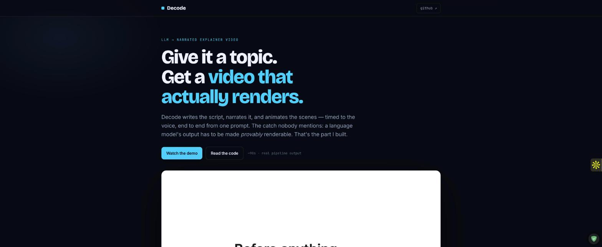
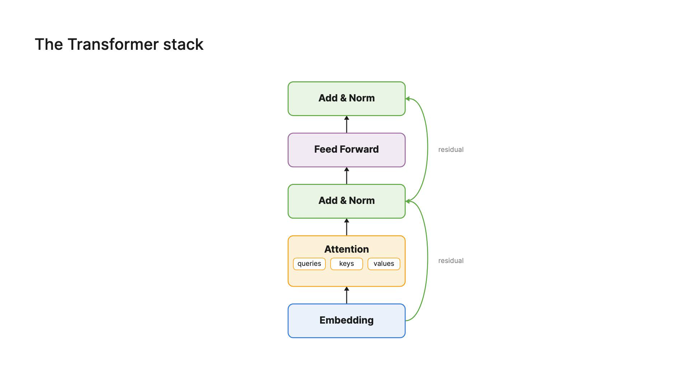
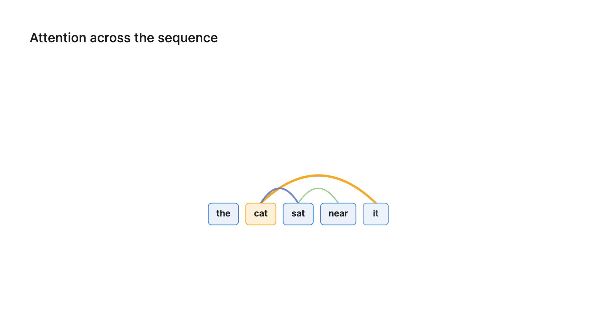
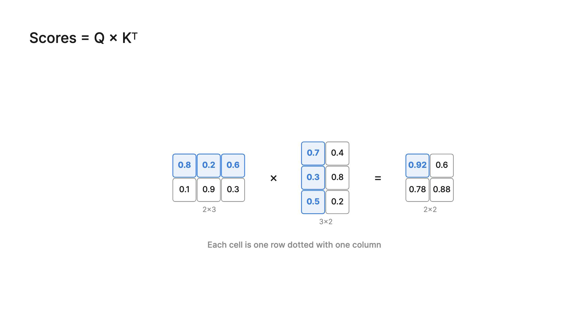
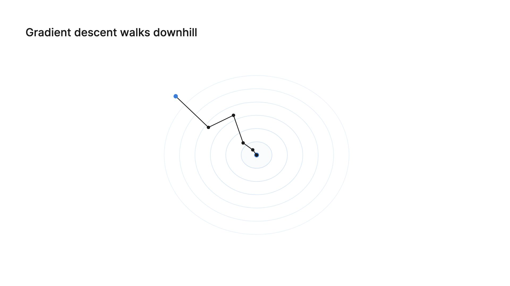

# Decode

**Give it a topic, get a narrated explainer video.** Decode writes the script, narrates it, and renders animated scenes timed to the voice — end to end, from one prompt.

### ▶ [Live demo & walkthrough →](https://decode-ai.up.railway.app)

[](https://decode-ai.up.railway.app)

*Real pipeline output, 90s: self-attention → the transformer stack → gradient descent.*

| | | | |
|---|---|---|---|
|  |  |  |  |
| BlockDiagram | SequenceLinks | MatrixOp · Q·Kᵀ | LossLandscape |

*Every frame above is generated by the same pipeline — nothing overlapping, nothing off-screen, on one palette, by construction.*

---

## The interesting part

The LLM is the easy half. The hard part is making a language model's output **actually renderable** — and *guaranteed* renderable, not renderable-if-you're-lucky.

So the model never emits pixels or raw coordinates. It **composes** a scene from a fixed library of visual primitives (token cells, block diagrams, weighted-attention arcs, matrix ops, loss landscapes…), and a **deterministic execution layer** validates every scene before it renders:

- **collision detection** — no two elements overlap
- **boundary + safe-margin checks** — nothing runs off-frame or crowds the edge
- **text bounding boxes** — labels are measured, never guessed, so they never clip
- **word-level timing** — every reveal fires on the narration word that names it (narration is the timing authority)

A scene that violates any of these is **caught and repaired before it ships**, not rendered broken. Same input → same frames, every time.

There's also a **vision loop**: three stills of each scene are rendered and judged by a multimodal model against the scene's intended storyboard (is it static? front-loaded? does the arc land?), and failures are repaired — so the gate is on *"is it actually good"*, not just *"does it compile."*

The bet is **correctness-by-construction**: constrain the model to a grammar it can't break, and it can't produce an overlapping, off-screen, or off-palette scene — because the primitives own the geometry, not the LLM.

## How it works

```
topic ─▶ Teaching Plan ─▶ Script (narration) ─▶ Visual Direction ─▶ Scene author (LLM composes primitives)
                                                                          │
                                              deterministic validation ◀──┘
                                              (collision · bounds · text-fit · timing)
                                                          │
                                              vision loop (render → critique → repair)
                                                          │
                                                    Remotion render ─▶ MP4
```

- **Author model** is pluggable (OpenAI / Gemini / any OpenRouter model) — the component contract is generated from the TypeScript source, so the model is always handed props that exist.
- **Narration** drives sub-scene timing via Whisper-aligned word timestamps.
- **Render substrate** is Remotion (React → deterministic frames) with headless Chrome.

## Stack

Next.js 15 · React 19 studio · FastAPI modular monolith · SQLAlchemy 2 · Postgres · Redis · ARQ worker + transactional outbox · Remotion · Fish Audio TTS + Whisper alignment.

## Run it locally

Prerequisites: Docker Desktop, Node + npm, Python 3.11+ (and optionally `uv`).

```bash
make setup    # deps + local env files
make dev      # Postgres + Redis + migrations + API, dispatcher, worker, frontend
```

Studio at <http://localhost:3000/studio>, API docs at <http://localhost:8000/docs>.
`make test` runs the suite; `make check` adds ruff, mypy, and a production build.

## Status

A working research prototype exploring correctness-by-construction for LLM-generated video. The generation pipeline (plan → script → visual direction → validated scene authoring → vision loop → render) runs end to end; the demo above is real pipeline output. It is not a hosted product.

## Design notes

`CLAUDE.md` (engineering + product invariants), `MASTER.md` (design system), and `docs/` cover the architecture and the decisions behind it.
