# Visual Direction Architecture

## Status

Accepted and partially implemented. Typed contracts and the project-level durable
task now run before scene fan-out. Visual Direction remains task-local intermediate
state; no persisted artifact schema or approval boundary changed.

## Context

Decode can retrieve a strong scene pattern and compose reliable visual components,
but that does not decide how an explanation develops through time. Generating TSX
directly from a teaching beat compresses visual direction, choreography, rendering,
and review into one model decision. The common result is a scene that assembles once
and then waits for the narration to finish.

The Teaching Plan must remain the owner of what is taught and in what order. The
Script remains the only editable narration. Visual changes must not reset either.
Narration remains the timing authority, and component geometry remains a renderer
detail.

## Decision

Insert a component-agnostic visual-direction layer downstream of the Script:

```mermaid
flowchart LR
    P[Teaching Plan] --> S[Script]
    S --> V[Visual Bible + Film Rhythm]
    V --> B[Scene Storyboards]
    B --> M[Narration-Anchored Moments]
    M --> R[Pattern + Component Selection]
    R --> C[Semantic Choreography]
    C --> D[Deterministic Rendering]
    D --> E[Temporal + Visual Evaluation]
    E --> A[Film Assembly + Handoffs]
```

The first durable vocabulary consists of:

- `ProjectVisualBible`: one production-wide visual and motion language. It does
  not copy the effective palette, which remains derived from Production Intent
  overriding the approved Teaching Plan.
- `FilmRhythm`: ordered scene modes, energy, density, pace, and pauses without a
  second copy of runtime.
- `SceneStoryboard`: named semantic subjects and the visual thesis for one beat.
- `NarrationPhraseAnchor`: words plus alignment and occurrence, never seconds,
  frames, progress, or word indices.
- `ChoreographyOperation`: a closed semantic action over subject references.
- `SceneHandoff`: an explicit carrier or deliberate reset at every boundary.
- `VisualDirection`: the validated aggregate joining those decisions.

## Ownership Boundaries

| Layer | Owns | Must not own |
|---|---|---|
| Teaching Plan | objectives, order, teaching structure, visual opportunity | components, motion, narration |
| Script | exact spoken words and semantic segments | visual implementation |
| Visual Direction | visual language, rhythm, subjects, state changes, continuity | copied narration, component names, coordinates, frames |
| Renderer | pattern, components, geometry, interpolation, generated source | teaching-order changes |
| Evaluator | deterministic and perceptual verdicts | silent mutation or new creative direction |
| Assembler | timing placement and scene-boundary execution | scene-local redesign |

## Invariants

1. Every operation resolves from a narration phrase. Missing phrases surface as
   unresolved; they never silently fire at zero.
2. Every operation references declared scene subjects.
3. Rhythm and storyboards cover the same beat IDs in the same order.
4. Every adjacent boundary has either a validated carrier or an explicit reset.
5. Visual direction contains no renderer API names or open parameter dictionaries.
6. Application code validates beat coverage and every phrase anchor against the
   exact approved Teaching Plan and Script before rendering or persistence.
7. A scene-level redraw may replace only that scene's storyboard, handoffs, and
   render output. It does not reset Teaching Plan or Script approval.
8. Project-wide bible or rhythm changes are broader proposed changes, not disguised
   scene redraws.

## Alternatives Considered

### Put choreography in the Teaching Plan

Rejected. Phrase anchors do not exist until the Script is written, and visual edits
would become entangled with pedagogical approval.

### Let patterns own all motion

Rejected. Patterns are implementation starting points. They cannot decide the
production's energy curve, visual metaphor, or continuity without becoming rigid
templates.

### Return directly to unrestricted generated animation code

Rejected as the default. It restores creative range but loses geometry, consistency,
safety, and validation. A controlled primitive layer can be added later beneath the
same semantic storyboard contract.

### Persist a new artifact immediately

Deferred. Adding an artifact type currently touches the fixed department pipeline,
context assembly, lineage roles, API commands, and schema versions. The contracts can
be exercised first inside production-task outputs without prematurely fixing those
persistence semantics.

## Rollout

1. Land and test the typed contracts. **Implemented.**
2. Add a project-level visual-direction task before scene fan-out. **Implemented.**
3. Build one focused scene handoff per beat in application code. **Implemented.**
4. Give the renderer the focused handoff plus narration and approved facts. **Implemented.**
5. Map semantic operations onto the generated component manifest and pattern library.
   **Implemented as renderer direction; richer component-state mappings remain.**
6. Add temporal checks for dead zones, front-loaded builds, anchor ordering, and
   unresolved final states.
7. Execute carriers and deliberate resets in the film assembler.
8. Decide persistence and schema-versioning only after the end-to-end shape proves
   stable.

## Consequences

The extra planning pass adds model latency and another validation boundary. In return,
Decode gains a stable place to improve engagement without multiplying components or
putting animation math into prompts. Renderer technologies and component catalogs can
change without rewriting the production's creative intent.
