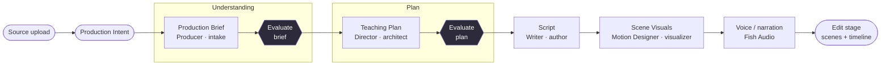
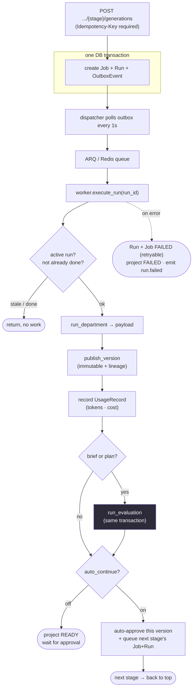

# flow.md — how a Decode project moves end to end

A debugging map. Follow a project from "create" to "narrated scenes on the Edit
timeline", naming the exact file at each hop so you know where to put a
breakpoint. Authoritative on *flow*; `MASTER.md` stays authoritative on design,
`.omc/plans/decode-backend-foundation.md` on the deep architecture rationale.

---

## The flow at a glance

### A. The journey — where a project goes, stage by stage

One creator request walks this whole line, end to end, with no per-stage
approval gate. Creating a project takes the creator straight through inputs → a
build/processing screen → **Edit**; there is no separate Understanding / Plan /
Script navigation to stop at (those pages are deep-links only — plan and script
are now tabs in the Edit inspector). The brief and the plan pass through the
independent **Evaluator** before the chain hands them on; script, visuals and
voice are not evaluated (yet).



Each arrow between stages is taken automatically as soon as the next stage's
inputs are available — continuous is the only mode now. The
Continuous / Stage-by-stage toggle is **gone from the UI**; the backend
`auto_continue` column still exists and is honored (default **true**), so in
practice the whole chain runs unattended from create to Edit (see §5).

### B. Inside one stage — the generation loop every stage runs

Every box in diagram A is really this loop. This is the reliable async path
(outbox → dispatcher → worker) and where "via eval and stuff" happens.



Progress is streamed to the UI the whole time over SSE (§8): `job.queued` →
`run.started` → `run.progress` (named steps, incl. `evaluating_brief`) →
`artifact.version.created` → `artifact.ready_for_review` → `job.succeeded`.

### C. The same flow, in words

Read this as the story the diagrams tell. File pointers in **bold** for
breakpoints; the deeper "why" for each hop is in the numbered sections below.

1. **The creator sets up inputs.** They create a project, upload source material,
   and save a Production Intent (audience, depth, runtime, narration style). The
   Intent is the first immutable version and the root of all lineage. Nothing has
   generated yet — the studio shows `draft` / `understanding`.
   *(`decode/projects/router.py`)*

2. **They ask for the Production Brief.** A `POST .../production-brief/generations`
   comes in with an `Idempotency-Key`. In **one transaction** the backend writes a
   Job, its first Run, and an OutboxEvent, and flips the project to `processing`.
   The HTTP call returns `202` immediately — the work hasn't happened yet.
   *(`decode/execution/router.py` → `pipeline.create_job`)*

3. **The outbox hands the work to the worker.** The dispatcher, polling every
   second, sees the OutboxEvent and enqueues an ARQ job onto Redis; the worker
   picks it up. This indirection is what makes it crash-proof — the "please run
   this" fact was committed atomically with the Job itself.
   *(`decode/execution/dispatcher.py` → `worker.execute_run`)*

4. **The worker runs the Producer and publishes the brief.** It claims the run
   (guarding against stale/duplicate delivery), assembles the bounded context the
   Producer is allowed to see, calls the department, and publishes the result as a
   new **immutable** ArtifactVersion with lineage back to the Intent. It records a
   UsageRecord (tokens + cost).
   *(`worker.execute_run` → `pipeline.run_department` → `domain.publish_version`)*

5. **The brief is evaluated — this is the "via eval" step.** Because the brief is
   one of the two evaluated types, the worker calls the independent Evaluator *in
   the same transaction*: cheap structural checks first, then a model judge, then
   an `Evaluation` row and its own UsageRecord. The Evaluator only records
   evidence — it never rewrites or approves the artifact.
   *(`pipeline.run_evaluation` → `decode/departments/evaluator/`)*

6. **The chain keeps going automatically.** With the brief published and judged,
   `continue_chain` checks `project.auto_continue` — which is `true` by default
   and has no UI to turn off — so it records an auto-approval (under actor
   `decode:auto-continue`), carries the inputs forward, and queues the next
   stage's Job+Run — the Teaching Plan. (The off branch still exists in code and
   would park the project at `ready`, but nothing in the studio reaches it.)
   *(`pipeline.continue_chain`)*

7. **The Teaching Plan repeats steps 3–6**, and is **also evaluated** (the second
   evaluated type). Approving the plan hands on to the Script.

8. **The Script repeats steps 3–6, without evaluation.** From here on there is no
   eval gate. Approving the script hands on to Scene Visuals.

9. **Scene Visuals repeat steps 3–6, without evaluation.** The Motion Designer
   produces one animated scene module per beat. Approving hands on to Voice.

10. **Voice repeats steps 3–6, without evaluation.** The Narrator (Fish Audio)
    reads each beat aloud and stores an mp3 per clip in the object store. This is
    the last link in the chain — `continue_chain` finds no successor and stops.
    Narration is the timing authority (**ADR-005**): the measured clip duration
    gives each scene its real runtime, and the per-clip **word timestamps** now
    drive sub-scene timing too — the beat-timing model in `decode/timing.py`
    (`NarrationTiming` + semantic `Anchor`s that resolve to seconds) lets visual
    events inside a scene land on the words they describe, not on guessed offsets.
    *(`decode/departments/voice/`, `decode/timing.py`, served by
    `decode/voice_router.py`)*

11. **The project lands on Edit — the single workspace.** With every stage
    published and narration rendered, the studio snapshot's derived
    `current_stage` becomes `edit`, and that is where the creator arrives. The
    connected frontend loads the generated scenes, compiles them in the browser,
    plays them against the narration, and offers render/export. Plan and script
    live as **inspector tabs** inside this one workspace rather than as separate
    stages to visit.
    *(`components/connected/ConnectedEdit.tsx`, `lib/scene-module.ts`)*

> The whole way through, every `emit(...)` streams a named progress event to the
> UI over SSE — so the creator watches "reading sources → drafting → evaluating →
> ready" instead of a spinner. The `auto_continue`-off branch below is a
> backend-only path with no UI to reach it; today the chain always runs straight
> through to Edit.

---

## 0. The pieces that must be running

`make dev` starts five things (see `Makefile`):

| Process | What it is | Dies → symptom |
|---|---|---|
| Postgres (`compose.yaml`) | durable state + outbox | nothing persists; API 500s on startup |
| Redis (`compose.yaml`) | ARQ queue + SSE fan-out | jobs queue but never run |
| **API** (`decode/main.py`, uvicorn) | FastAPI, all HTTP routes | frontend can't talk to backend |
| **dispatcher** (`decode/execution/dispatcher.py`) | polls the outbox every 1s, enqueues ARQ jobs | jobs stay `QUEUED` forever, never `RUNNING` |
| **worker** (`decode/execution/worker.py`, ARQ) | runs one department per job | same: `QUEUED` forever |

If a generation "hangs", the first question is always **which of these three
(dispatcher / worker / Redis) is down** — see §7.

---

## 1. The domain model (the nouns)

Defined in `decode/models.py`. Five that matter for flow:

- **Project** — the unit of work. Has `status` (draft → processing → ready →
  failed) and `auto_continue` (the per-project chain switch, §5 — default `true`,
  no longer surfaced as a UI toggle).
- **Artifact** — a *slot* of one type (`production_brief`, `teaching_plan`,
  `script`, `scene_visuals`, `voice`). One per type per project (`stable_key`).
  Holds two pointers: `latest_version_id` and `approved_version_id` — **distinct**.
- **ArtifactVersion** — an immutable published payload. New work = new version;
  **a Postgres trigger blocks mutation** of an existing one. Carries `parents`
  (lineage edges) and `owner_role` (which crew member made it).
- **Job** — a durable request for one stage's output (`kind =
  generate_<type>`). Points at its `active_run_id` and, on success,
  `result_artifact_version_id`.
- **Run** — one *attempt* at a job. Retries make a new Run, not a new Job.

Plus **Evaluation** (a review attached to a version, §6), **UsageRecord** (token
+ cost metering), **OutboxEvent** (the transactional queue, §7), **ApprovalDecision**.

> Version vs Job vs Run, in one line: the *Version* is the noun you keep, the
> *Job* is "please make it", the *Run* is "attempt #n at making it".

---

## 2. Setting up the inputs (before any generation)

All under `decode/projects/router.py`:

1. `POST /api/v1/projects` → a Project (`create_project`).
2. `POST /projects/{id}/sources` → upload source material (PDF/text). Lease-owned
   per attempt; stored in the object store (`decode/providers/storage.py`, local
   dir in dev, R2 in prod).
3. `POST /projects/{id}/production-intent/versions` → the creator's direction
   (audience, runtime mode, depth, narration style). This is the first
   ArtifactVersion and the root of all lineage.

Nothing has generated yet. `GET /projects/{id}/studio` now returns
`current_stage = "draft"` or `"understanding"`.

---

## 3. Kicking off generation (the request lifecycle)

Entry points live in `decode/execution/router.py` — one POST per stage:

```
POST .../production-brief/generations   → 202
POST .../teaching-plan/generations      → 202
POST .../script/generations             → 202
POST .../scene-visuals/generations      → 202
POST .../voice/generations              → 202
```

Every one requires an **`Idempotency-Key` header**. Same key + same body →
replays the stored response; same key + different body → **409** (this is a
common "why did my request fail" — you reused a key).

What a generation POST does, all in one DB transaction (`pipeline.create_job` →
`pipeline.start_run`):

1. Validates that the inputs it was given match what the stage `consumes`.
2. Creates a **Job** and its first **Run**, with a `context_manifest` +
   `context_hash`.
3. Sets `project.status = PROCESSING`.
4. Writes an **OutboxEvent** `run.execute` — *in the same transaction*. This is
   the handoff to async work. It does **not** call Redis directly (that's the
   whole point of the outbox — see §7).
5. Emits a `job.queued` progress event.

The HTTP response returns immediately (202). The actual work happens later, off
the queue.

---

## 4. The stage table (what each department is)

`decode/execution/pipeline.py` is the **Project Manager**: it routes jobs to
departments and nothing else invokes a department. The stage table `STAGES` is
**derived at import** from each department's `SKILL.md` (`_discover()`), so a
department declares its own `produces` / `consumes` / `crew_role` and there is no
second copy to drift.

| Job kind | Department (`decode/departments/…`) | Consumes | Produces | Crew role |
|---|---|---|---|---|
| `generate_production_brief` | `intake/` | source, production_intent | production_brief | Producer |
| `generate_teaching_plan` | `architect/` | production_brief, production_intent | teaching_plan | Director |
| `generate_script` | `author/` | teaching_plan, production_intent | script | Writer |
| `generate_scene_visuals` | `visualizer/` | script, teaching_plan, production_intent | scene_visuals | Motion Designer |
| `generate_voice` | `voice/` | script, production_intent | voice | (Writer's narration) |

Providers are chosen by `Settings` (`DECODE_INTAKE`, `DECODE_EVALUATOR`,
`DECODE_VOICE`, …). `fake` = deterministic fixture that labels its output
(`fixture: true`); real = OpenAI (intake/architect/author/visualizer/evaluator)
or Fish Audio (voice). `run_department()` is the dispatch: context type →
department instance.

The bounded context each department receives is built by
`decode/execution/context.py` (`ContextAssembler`) — it validates the immutable
job inputs and hands the department *only* its own view (e.g. the Writer sees the
plan + intent, never the raw source).

---

## 5. The chain (why approving one stage runs the next)

`CHAIN` in `pipeline.py`:

```
brief → teaching_plan → script → scene_visuals → voice → (stop)
```

After a run succeeds, `continue_chain()` runs **inside the worker's success
transaction**. `project.auto_continue` is `true` by default and the studio no
longer exposes a toggle for it (the old Continuous / Stage-by-stage switch is
gone), so continuous is the only path a real project takes:

- **On** (the normal case): it records an `ApprovalDecision` on the finished
  version under the actor `decode:auto-continue` (so "who approved this" is never
  empty), carries the inputs the next stage needs forward, and creates the next
  Job+Run.
- **Off** (backend-only, unreachable from the UI): it stops — the pointer moves,
  nothing auto-runs, and the project waits for a hand-approval that the studio
  has no button to send.

The input-carry is why voice can follow visuals with no new input: voice needs
`script` + `production_intent`, both of which the visuals job already carried, so
`continue_chain` forwards them unchanged.

> **Debugging the chain:** if a project stops early, check `project.auto_continue`
> first, then whether the next stage needs an input the finished one never saw
> (then `continue_chain` returns `None` by design and waits for the creator).

---

## 6. What the worker actually does (per run)

`decode/execution/worker.py`, `execute_run(run_id)` — the heart. Ordered:

1. **Claim the run** with `SELECT … FOR UPDATE`. Guards: if
   `job.active_run_id != run.id` → `stale_run` (a redelivered/superseded
   attempt, returns without doing work). If already succeeded → `already_succeeded`.
2. Mark run + job `RUNNING`, project `PROCESSING`, emit `run.started` /
   `run.progress`. **Commit** (so the UI sees "started" even if step 3 is slow).
3. Assemble context (`context_assembler.assemble`), open a tracing span
   (`decode/departments/tracing.py`, no-op unless Langfuse configured).
4. `run_department()` → the department produces its payload.
5. `publish_version()` (`decode/domain.py`) — new immutable ArtifactVersion,
   with lineage `parents` and `owner_role`. Emit `artifact.version.created`.
6. Record a **UsageRecord** (tokens, model, duration, `estimate_cost` from
   `decode/pricing.py`).
7. **Evaluation** (`pipeline.run_evaluation`, §6a) for brief/plan only.
8. Mark run + job `SUCCEEDED`, project `READY`.
9. `continue_chain()` (§5) — may flip project back to `PROCESSING`.
10. Emit `artifact.ready_for_review` (carries the evaluation decision +
    `auto_approved` flag) and `job.succeeded`. **Commit.** Update trace + score.

On any exception: mark run + job `FAILED` with a `retryable` failure, project
`FAILED`, emit `run.failed`, flush the trace, re-raise. The already-published
version from a *prior* success is never failed (the `stale_run` guard).

### 6a. Evaluation (the independent judge)

`pipeline.run_evaluation()` runs **in the same run/transaction** as generation —
it is not its own stage and produces no artifact version. It applies only to
`production_brief` and `teaching_plan` (the set `EVALUATED_TYPES`), runs
deterministic structural checks first and the model judge only if those pass,
writes an `Evaluation` row + a `UsageRecord`, and returns the decision so the
worker can attach it to `artifact.ready_for_review` and the trace score. The
evaluator (`decode/departments/evaluator/`) never rewrites or approves — it only
records evidence. To extend evaluation to script/visuals: add the type to
`EVALUATED_TYPES` + an evaluator method (no worker change).

---

## 7. The outbox → dispatcher → ARQ path (why async is reliable)

The single most important reliability mechanism, and the usual suspect when
"nothing runs":

```
generation POST ──tx──▶ [Job, Run, OutboxEvent] committed together
                                   │
        dispatcher (1s poll) ──────┘  reads unpublished OutboxEvents,
                                      enqueue_job("execute_run", run_id,
                                                  _job_id="run:<id>")
                                      marks event published_at
                                   │
                              ARQ / Redis
                                   │
                              worker.execute_run(run_id)
```

- The Job/Run and the "please enqueue" fact commit **atomically** — a crash
  between them is impossible, so a job can never be created without being
  eventually enqueued (transactional outbox).
- `_job_id = "run:<run_id>"` makes ARQ **dedupe** redeliveries — at-least-once
  delivery, but the worker's `stale_run` / `already_succeeded` guards make it
  effectively once.
- **Debug:** job stuck `QUEUED` → is the dispatcher process alive? Job flips to
  `RUNNING` then nothing → is the worker alive / erroring (check worker logs)?
  `OutboxEvent.published_at IS NULL` piling up → dispatcher down.

---

## 8. Live progress to the UI (SSE)

- `GET /api/v1/…/events/stream` (`decode/execution/router.py`) is a
  Server-Sent-Events stream.
- Every `emit(...)` in the worker/pipeline writes a domain event that fans out to
  this stream (via Redis).
- The UI never polls a spinner — it renders the **named** progress steps
  (`reading_sources`, the stage's `progress_step`, `evaluating_brief`, …). This
  is the "nothing is a bare loading state" invariant.

Progress event vocabulary: `job.queued`, `run.started`, `run.progress`,
`artifact.version.created`, `artifact.ready_for_review`, `job.succeeded`,
`run.failed`.

---

## 9. Reading state back

- `GET /projects/{id}/studio` (`projects/router.py`) — the snapshot the studio
  renders. `current_stage` is **derived, not stored** (`current_stage()`):
  a running/queued/failed recent job → `"processing"`; else furthest artifact
  wins (`visuals → edit`, `script → script`, `plan → teaching_plan`,
  `brief → understanding`, else `draft`).
- `GET /production-brief`, `GET /artifacts/{id}/versions`,
  `.../versions/{vid}/lineage` — artifact history + the lineage graph.
- `GET /jobs/{id}`, `.../jobs/{id}/usage` — job status + metering.
- `POST /jobs/{id}/retries` — new Run for a failed Job (idempotent).
- Approvals: `POST /artifacts/{id}/versions/{vid}/approvals`. Editing:
  `POST /artifacts/{id}/versions` (publishes a new version — never mutate).

---

## 10. Voice audio + render

- Voice clips are stored in the object store and served by
  `decode/voice_router.py` (`GET /voice/{key}`).
- Render/export is its own department + routes (`decode/renders/`):
  `POST /projects/{id}/renders` (202), `GET /renders/{id}`,
  `GET /renders/{id}/download`. The worker shells out to a Node/Remotion script
  (`apps/frontend/scripts/render-video.ts`) behind the renderer boundary
  (`providers/renderer.py`) — no HyperFrames adapter exists yet.

---

## 11. The frontend side (connected app)

Two frontends share `apps/frontend/src` (see `CLAUDE.md`). The **connected** one
is the real backend-driven slice:

- Data client: `lib/decode-api.ts` (fetch + SSE). All the routes above.
- Routes: `app/studio/projects/[projectId]/{page,script,edit}` — real URLs.
- Stage shells: `components/connected/Connected{Processing,TeachingPlan,Script,Edit}.tsx`.
- `ConnectedEdit` loads generated `scene_visuals`, compiles each scene module in
  the browser (`lib/scene-module.ts`, `components/player/GeneratedScene.tsx`),
  drives voice generation + render, and hydrates durable artifacts into the
  prototype's Zustand store to reuse the Edit workstation.

The **prototype** frontend (`/` → `components/Studio.tsx`, seeded `lib/api.ts`)
is the full product faked; new backend work goes on the connected side.

---

## 12. Fastest path to the bug

| Symptom | Look here first |
|---|---|
| Generation POST 409 | reused `Idempotency-Key` with a different body |
| Job stuck `QUEUED` | dispatcher process down, or Redis down |
| Job `RUNNING` then silent | worker logs — a department raised |
| Chain stopped early | `project.auto_continue` off, or next stage needs an unseen input (§5) |
| "processing" won't clear | a later chained job (e.g. voice) is still queued/failed |
| Wrong/None evaluation | only brief+plan are evaluated (`EVALUATED_TYPES`) |
| Voice 500 / no audio | Fish Audio creds/model header, or `DECODE_VOICE` still `fake` |
| Hydration mismatch in player | un-quantized `sin/cos/pow` reaching the DOM (see `CLAUDE.md` traps) |
| `Maximum update depth` | two-way sync of state with one owner (see `CLAUDE.md`) |
